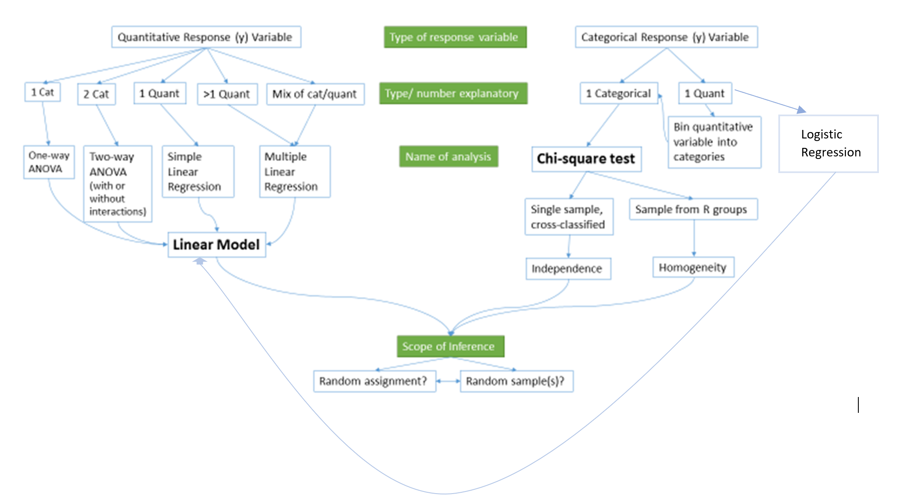
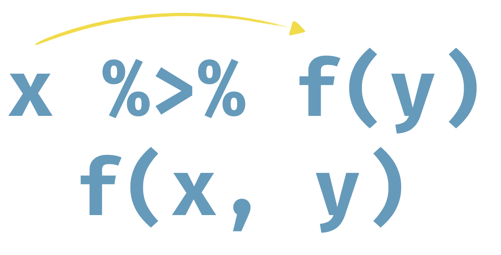

---
output:
  html_document: default
  pdf_document: default
---
\mainmatter

# Introduction to `R` and RStudio {#chapter1}


::: {.chapterintro}
Scientists seek to answer questions using rigorous methods and careful
observations. These observations – collected from the likes of field notes,
surveys, and experiments – form the backbone of a statistical investigation and
are called data. Statistics is the study of how best to collect, analyze, and
draw conclusions from data, and in this first chapter, we focus on both the
properties of data and on the collection of data. 
- _Introduction to Modern Statistics_, Mine Çetinkaya-Rundel & Jo Hardin
:::

This book is designed primarily for use in a second semester 
statistics course although it can also be
useful for researchers needing a quick review or ideas for using `R` for the
methods discussed in the text. As a text primarily designed for a second
statistics course, it presumes that you have had an introductory statistics
course. There are now many different varieties of introductory statistics from
traditional, formula-based courses (called "consensus" curriculum courses) to
more modern, computational-intensive courses that use randomization ideas to try to
enhance learning of basic statistical methods. We are not going to presume that
you have had a particular "flavor" of introductory statistics or that you had
your introductory statistics out of a particular text, just that you have had a
course that tried to introduce you to the basic terminology and ideas
underpinning statistical reasoning. We would expect that you are familiar with
the logic (or sometimes illogic) of hypothesis testing including null and
alternative hypothesis \index{hypothesis testing} and confidence interval
\index{confidence interval} construction and interpretation,
and that you have seen all of these concepts in a couple of basic situations. We
start with a review of these ideas in one and two group situations with a
quantitative response, something that you likely have seen before. 


\indent This text covers a wide array of statistical tools that are connected
through situation, methods used, or both. As we explore various techniques, look
for the identifying characteristics of each method -- what type of research
questions are being addressed (relationships or group differences, for example)
and what type of variables are being analyzed (quantitative or categorical). 
***Quantitative variables*** \index{quantitative} are made up of numerical
measurements that have meaningful units attached to them, so that averages of 
measurements make sense. For example, averages of student heights is meaningful, 
but averages of letter grades are not. ***Categorical variables*** 
\index{categorical} take on values that are categories or labels, such as 
letter grades. Additionally, you will need to carefully identify the 
***response*** \index{response} and ***explanatory*** \index{explanatory}
variables, where the study and variable characteristics should suggest which
variables should be used as the explanatory variables which may explain
variation in the response variable. Because this is an intermediate statistics
course, we will start to handle more complex situations (many explanatory
variables), while also providing tools for data wrangling and data visualization, 
complementing the more sophisticated statistical models required to handle these
situations. 


## Overview of Methods {#section1-1}

After you are introduced to basic statistical ideas, a wide array of statistical
methods become available. The methods explored here focus on assessing 
(estimating and testing for) relationships between variables, sometimes when
controlling for or modifying relationships based on levels of another variable
-- which is where statistics gets interesting and really useful. Early
statistical analyses (approximately 100 years ago) were focused on describing a
single variable. Your introductory statistics course should have explored
methods for summarizing, visualizing, and doing inference in
situations with one group or where you were comparing results for two groups of
observations. Now, we get to consider more complicated situations -- culminating
in a set of tools for working with multiple explanatory variables, some of
which might be categorical and related to having different groups of subjects
that are being compared. Throughout all of the methods we will cover, it will be
important to retain a focus on how the appropriate statistical analysis depends
on the research question and data collection process as well as the types of
variables measured. 

\indent Figure \@ref(fig:Figure1-1) frames the topics we will discuss. Taking a broad
view of the methods we will consider, 
there are basically two scenarios -- one when the response is quantitative and
one when the response is categorical. Examples of quantitative responses we will
see later involve *passing distance of cars for a bicycle rider* (in centimeters)
and *body fat* (percentage). Examples of categorical variables include 
*improvement* (none, some, or marked) in a clinical trial related to arthritis
symptoms or whether a student has turned in copied work (never, done this on an
exam or paper, or both). There are going to be some more nuanced aspects to all
these analyses as the complexity of both sides of Figure \@ref(fig:Figure1-1)
suggest, but note that near the bottom, each tree converges on a single
procedure, using a ***linear model*** \index{model!linear} for a quantitative
response variable or using a ***Chi-square test*** for a categorical response.
\index{Chi-Square Test} After selecting the appropriate procedure and completing
the necessary technical steps to get results for a
given data set, the final step involves assessing the scope of inference 
\index{scope of inference} and
types of conclusions that are appropriate based on the design of the study. 


(ref:fig1-1) Flow chart of data analysis procedures.

<div class="figure" style="text-align: center">

<p class="caption">(\#fig:Figure1-1)(ref:fig1-1)</p>
</div>

\indent We will be spending most of the semester working on methods for quantitative
response variables (the
left side of Figure \@ref(fig:Figure1-1) is covered in Chapters \@ref(chapter2),
\@ref(chapter3), \@ref(chapter4), \@ref(chapter6), \@ref(chapter7), and
\@ref(chapter8)), stepping
over to handle the situation with a categorical response variable in Chapter
\@ref(chapter5) (right side of Figure \@ref(fig:Figure1-1)).
Chapter \@ref(chapter9) contains case studies
illustrating all the methods discussed previously, providing a final opportunity
to explore additional examples that illustrate how finding a
path through Figure \@ref(fig:Figure1-1) can lead to the appropriate analysis. 

\indent The first topics (Chapters \@ref(chapter1), and \@ref(chapter2)) will be
more familiar as we start with single and two group situations
with a quantitative response. In your previous statistics course, you should
have seen methods for estimating and quantifying uncertainty for the mean of a
single group and for differences in the means of two groups. Once we have
briefly reviewed these methods and introduced the statistical software that we
will use throughout the course, we will consider the first new statistical
material in Chapter \@ref(chapter3). It involves the situation with a
quantitative response variable where
there are more than 2 groups to compare -- this is what we call the ***One-Way
ANOVA*** situation. It generalizes the 2-independent sample hypothesis
test to handle situations where more than 2 groups are being studied. When we
learn this method, we will begin discussing model assumptions 
\index{assumptions} and methods for assessing those assumptions that will be
present in every analysis involving a
quantitative response. The ***Two-Way ANOVA*** (Chapter \@ref(chapter3))
considers situations with two categorical explanatory variables and a 
quantitative response. To make
this somewhat concrete, suppose we are interested in assessing differences in, 
say, the *yield* of wheat from a field based on the amount of *fertilizer*
applied (none, low, or high) and *variety* of wheat (two types). Here, *yield*
is a quantitative response variable that might be measured in bushels per acre
and there are two categorical explanatory variables, *fertilizer*, with three
levels, and *variety*, with two levels. In this material, we introduce the idea
of an ***interaction*** between the two explanatory variables: 
\index{interaction!Two-Way ANOVA} the relationship between one categorical
variable and the mean of the response changes depending on the levels of the
other categorical variable. For example, extra fertilizer might enhance the
growth of one variety and hinder the growth of another so we would say that 
*fertilizer* has different impacts based on the level of *variety*. Given this
interaction may or may not actually be present, we will consider two versions
of the model in Two-Way ANOVAs, \index{model!Two-Way ANOVA} what are called the
***additive*** \index{model!additive} (no interaction) and the ***interaction*** \index{model!interaction} models. 


\indent Following the methods for two categorical variables and a quantitative 
response, we explore a method for analyzing data where the response is
categorical, called the ***Chi-square test***
in Chapter \@ref(chapter5). This most closely matches the one-way ANOVA
situation with a single categorical explanatory variable, except now the
response variable is categorical. For example, we will assess whether taking a
drug (vs taking a ***placebo***^[A ***placebo*** is a treatment level designed
to mimic the potentially efficacious level(s) but that can have no actual
effect. The ***placebo effect*** is the effect that thinking that an effective
treatment was received has on subjects. There are other related issues in
performing experiments like the ***Hawthorne*** or ***observer effect*** where
subjects modify behavior because they are being observed.])
has an ***effect***^[We will reserve the term "effect" for situations where we
could potentially infer causal impacts on the response of the explanatory
variable which occurs in situations where the levels of the explanatory variable
are randomly assigned to the subjects.] on the type of improvement the subjects
demonstrate. There are two different scenarios
for study design that impact the analysis technique and hypotheses tested in
Chapter \@ref(chapter5). If the explanatory variable reflects the group that
subjects were
obtained from, either through randomization of the treatment level to the
subjects or by taking samples from separate populations, this is called a
***Chi-square Homogeneity Test***. \index{Chi-Square Test!Homogeneity Test} It
is also possible to obtain a single sample
from a population and then obtain information on the levels of the explanatory
variable for each
subject. We will analyze these results using what is called a 
***Chi-square Independence Test***. \index{Chi-Square Test!Independence Test}
They both use the same test statistic but we will use slightly different
graphics and are testing different hypotheses in these two related situations.
Figure \@ref(fig:Figure1-1) also shows that if we had a quantitative explanatory
variable and a categorical response that we could "bin" or create
categories of responses from the quantitative variable to use the Chi-square
testing methods. Alternatively, if we did not create categories from the 
quantitative explanatory variable, we would use a **Logistic Regression**. 
This type of data model will be covered in additional statistics classes, but 
has connections to the linear models discussed in this textbook.


\indent If the predictor and response variables are both quantitative, we start
with scatterplots, correlation, 
and ***simple linear regression*** models (Chapters \@ref(chapter6) and
\@ref(chapter7)) -- things you should have seen, at least to some degree, in 
your introductory statistics course. The biggest differences here will be
the depth of exploration of diagnostics and inferences for this model and
discussions of transformations of variables included in the model. 
\index{transformation} If there is more than one explanatory variable, then we
say that we are performing a ***multiple linear regression***
(Chapter \@ref(chapter8)) -- where the "multiple" part of the procedure reflects
the inclusion of more than one explanatory variable in the model. We use the
same procedure if we have a mix of categorical and quantitative predictor
variables but there are some new issues in setting up the models and
interpreting the coefficients that we will need to consider. In the situation
with one categorical predictor and one quantitative predictor, we will revisit
the idea of an interaction. \index{interaction!MLR} 
An interaction allows us to consider situations
where the estimated relationship between a quantitative predictor and the 
mean response
varies across different levels of the categorical variable. In Chapter 
\@ref(chapter9), connections among all the methods used for quantitative
responses are discussed, showing that they all have the same foundation,
because they are all linear models \index{model!linear}. We also show how the
methods discussed can be applied to a suite of new problems using a set of case
studies and how that relates to further extensions of the methods.


\indent By the end of Chapter \@ref(chapter9) you should be able to identify,
perform using the statistical software `R` [@R-base], and interpret the results 
from each of these methods. There
is a lot to learn, but many of the tools for using `R` and interpreting results
of the analyses accumulate and repeat throughout the textbook. If you work hard
to understand the initial methods, it will help you when the methods get more
complicated. You will likely feel like you are just starting to learn how to
use `R` at the end of the semester and for learning a programming language that
is a big accomplishment! We will be taking you on the first steps of a
potentially long journey and it is up to you to decide how much further you
want to go with learning the software for wrangling, visualizing, and modeling 
data. 

\indent All the methods you will learn require you to carefully consider how the
data were collected, how that
pertains to the population of interest, and how that impacts the inferences
that can be made. The ***scope of inference*** from the bottom of Figure
\@ref(fig:Figure1-1) is our shorthand term for remembering to think about two
aspects of the study -- ***random assignment*** and ***random sampling***.
\index{random assignment} \index{random sampling} In a given
situation, you need to use the description of the study to decide if the
explanatory variable was randomly assigned to the study units (this allows for
***causal inferences*** \index{causal effect} if differences are detected) or 
not (where no causal statements are possible). As an example, think about two
studies, one where students are
randomly assigned to either get tutoring with their statistics course or not
and another where the students are asked at the end of the semester whether
they sought out tutoring or not. Suppose we compare the final grades in the
course for the two groups (tutoring/not) and find a big difference. In the
first study where students were randomly assigned to receive tutoring,
\index{random assignment} we can say the tutoring *caused* the
differences we observed. In the second, we could only say that the tutoring was
*associated* with differences. Because students self-selected the group they
ended up in, we can't say that the tutoring caused the differences. The other
aspect of scope of inference concerns random sampling: \index{random sampling} 
If the data were obtained using a random sampling mechanism, then our inferences
can be safely extended to the population that the sample was taken from.
However, if we have a non-random
sample, our inference can only apply to the sample collected. In the previous
example, the difference would be studying a random sample of students from the
population of, say, Introductory Statistics students at a university versus
studying a sample of students that volunteered for the research project, maybe
for extra credit in the class. We could still randomly assign them to
tutoring/not but the non-random sample would only lead to conclusions about
those students that volunteered. The most powerful scope of inference is when
random assignment is used in a random sample from a population -- conclusions
would be about causal impacts that we would expect to happen in the population. 


\indent By the end of this material, you should have some `R` skills to wrangle 
data in preparation for analysis, create professional quality data
visualizations, and the ability to fit ANOVA and regression models to data, as
well as to handle Chi-square testing situations. Together, this should prepare
you for future statistics courses or for other
situations where you are expected to be able to identify an appropriate
analysis, do the calculations and required graphics using the data set, and then
effectively communicate interpretations for the methods discussed here. 

## Getting Started in `R` {#section1-2}

You will need to download the statistical software package called `R` and an
enhanced interface to R called RStudio [@RStudio]. These are both open source
and free to download and use (and will always be that way). This means that the
skills you learn now can follow you the rest of your life. `R` is becoming the
primary language of statistics and is being adopted across academia, government,
and businesses to help manage and learn from the growing volume of data being
obtained. Hopefully you will get a sense of some of the power of `R` in this
book. 

\indent The next pages will walk you through the process of getting the software
downloaded and provide you with
an initial experience using RStudio to do things that should look familiar
even though the interface will be a new experience. Do not expect to master `R`
quickly -- it takes years (sorry!) even if you know the statistical methods
being used. We will try to keep all your interactions with `R` code in a similar
code format and that should help you in learning how to use `R` as we move
through various methods. We will also often provide you with example code.
Everyone that learns `R` starts with copying other people's code and then making
changes for specific applications -- so expect to go back to examples from the
text and focus on learning how to modify that code to work for your particular
data set. Only really experienced `R` users "know" functions without having to
check other resources. After we complete this basic introduction, Chapter 
\@ref(chapter2) starts the exploration of more sophisticated tasks in `R`,
allowing us to compare quantitative responses from two groups, make some
graphical displays, do hypothesis testing \index{hypothesis testing} and create
confidence intervals in a couple of different ways. 

\indent You will have two^[There is a cloud version of R Studio available at 
https://rstudio.cloud/ that is free for limited usage. We recommend following 
the steps to be able to work locally but try this option if you have issues with 
the installation process and need to complete an assignment or two until you get
the installation sorted out.] downloading activities to complete before
you can do anything more than read this book^[I created this interactive website (https://allisontheobold.shinyapps.io/R_RStudio_Setup/) that contains
discussions and activities related to installing and using R and RStudio.].
First, you need to download `R`. It is the engine that will do all the computing
for us, but you will only interact with it once. Go to http://cran.rstudio.com
and click on the "**Download R for...**" button that
corresponds to your operating system. On the next page, click on "**base**" and
then it will take you to a screen to download the most current version of `R` 
that is compiled for your operating system, something like 
"**Download R 4.0.2 for Windows**". Click on that link and then open the file
you downloaded. You will need to select your preferred language (choose English
so your instructor can help you), then hit "**Next**" until it starts to unpack
and install the program (all the base settings will be fine). After you hit
"**Finish**" you will not do anything further with `R` directly. 

\indent Second, you need to download RStudio. RStudio is an integrated 
development environment (IDE), which means it provides an enhanced interface that
will make interacting with `R` less frustrating and allow you to directly create
reports that include the code and output. To download RStudio, go near the
bottom of <https://www.rstudio.com/products/rstudio/download/> and select the
correct version under "Installers for Supported Platforms" for your operating
system. Download and then install RStudio using the installer. From this point
forward, you should only open RStudio; it provides your interface with `R`. 
Note that both `R` and RStudio are updated frequently (up to four times a year) 
and if you downloaded either more than a few months previously, you should
download the up-to-date versions, especially if something you are trying to do
is not working. Sometimes code will not work in older versions of `R` and
sometimes old code won't work in new versions of `R`.^[The need to keep the code
up-to-date as `R` continues to evolve is one reason that this book is locally
published and that this is the 7^th^ time it has been revised in seven years...]
 
(ref:fig1-2) Initial RStudio layout.

<div class="figure" style="text-align: center">

<p class="caption">(\#fig:Figure1-2)(ref:fig1-2)</p>
</div>

\indent To get started, we can complete some basic tasks in `R` using the
RStudio interface. When you open RStudio, you will see a screen like Figure 
\@ref(fig:Figure1-2). The
added annotation in this and the following screen-grabs is there to help you
get initially oriented to the software interface. R is command-line software --
meaning that in some way or another you have to create code and get it
evaluated, either by entering to be executed (run) in the command prompt (in the 
bottom left-hand panel) or by creating a document to store the code, and 
executing the code from that file. RStudio makes the management and
execution of that code more efficient than the basic version of `R`. 

In RStudio, the lower left panel is called the "console" window, and is where
all of the action happens. Every time you launch RStudio, it will have the same
text at the top of the console telling you the version of R that you're running. 
Below that information is the *prompt*, indicated by the `>` symbol.
As its name suggests, this prompt is really a request: a request for a command.
Initially, interacting with `R` is all about typing commands and interpreting
the output. These commands and their syntax have evolved over decades
(literally) and now provide what many users feel is a fairly natural way to
access data and organize, describe, and invoke statistical computations.

The upper left panel is for writing, saving, and running your `R` code either in
`R` script (.R) files or R Markdown (.Rmd) files. The panel in the upper right
contains your *environment* as well as a history of the commands that you've
previously entered. It also contains the "Import Dataset" button that provides
the easiest way for you to read a data set into `R` so you can analyze it.

The panel in the lower right contains tabs for browse the *files* in your
project folder, access *help* files for `R` functions, install and manage
`R` *packages*, and inspecting visualizations. By default, all data
visualizations you make will appear directly below the code you used to create
them. If you would rather your plots appear in the *plots* tab, you will need to
change your global options.

<!-- RUNNING CODE -->
<!-- Once you have code available -->
<!-- in this window, the "Run" button will execute the code for the line that your  -->
<!-- cursor is on or for any text that you -->
<!-- have highlighted with your mouse. -->

<!-- Going forward you should refrain from typing your code directly in the console, as this makes it very difficult to remember and reproduce the output you want to reference. -->
<!-- Potentially the most important feature of R Markdown files is that they allow for us to nest our `R` code within a written report. -->
<!-- In an R Markdown file, `R` code appears in a gray box, which we call "code chunks." The R Markdown file knows that the gray box contains `R` code because it begins with three tick marks (\`\`\`), followed by two curly braces that contain a lowercase letter r ({r}). -->
<!-- You've already seen this above! -->

<!-- Instead of typing our `R` code into the console, we encourage you to type any code you produce (final correct answer, or anything you're just trying out) in the `R` code chunk associated with each problem. -->
<!-- You can execute the `R` code you type in these code chunks similar to how you typed code into the console and pressed enter/return. -->
<!-- Within the code chunk there are two ways to execute a line of `R` code: (1) place your cursor on the line on code and press `Ctrl-Enter` or `Cmd-Enter` at the same time, or (2) place your cursor on the line and press the "Run" button in the upper right hand corner of the R Markdown file. -->
<!-- Alternatively, if you wanted to run all of the `R` code in a given code chunk, you can click on the "Play" button in the upper right hand corner of the code chunk (green sideways triangle). -->

<!-- If at any point you need to start over and run all of the code chunks before a specific code chunk, you click on the "Fastforward" button in the upper right hand corner of that code chunk (gray upside down triangle with a bar below). -->
<!-- This will run every code chunk that occurred *before* that code chunk, but *will not* execute the `R` code included in that code chunk. -->

### Using `R` as a Big Calculator

\indent As a first interaction with `R` we can use it as a very powerful
calculator. To do this, click near the command prompt (`>`) in the lower left
"console" panel, type `3+4`, and then hit enter. It should look like this:


```r
3 + 4
#> [1] 7
```

You can do more interesting calculations, like finding the mean of a set of 
numbers, say -3, 5, 7, and 8, You can do this by adding the numbers up and 
dividing by 4: 


```r
(-3 + 5 + 7 + 8) / 4
#> [1] 4.25
```

Note that the parentheses help `R` to figure out your desired order of
operations. If you drop that grouping, you get a very different (and wrong!) 
result:


```r
-3 + 5 + 7 + 8 / 4
#> [1] 11
```

We could the use a formula from introductory statistics to estimate the standard
deviation of this set of numbers, but that gets us away from the reason we are 
using `R`. To use the real power of `R` in this course, we need to work with
data sets that store observations for our subjects as *variables*, where 
each subject's information is stored in a different row. 

In `R`, data frames are the _de facto_ data structure, and what
we use for data processing, statistics, and plotting. A data frame is the
representation of data in the format of a table where the columns are vectors
that all have the same length. Data frames are analogous to the more familiar
spreadsheet in programs such as Excel, with one key difference. Because columns
are vectors, each column must contain a single type of data (e.g., characters,
integers, factors). For example, here is a figure depicting a data frame
comprising a numeric, a character, and a logical vector.

(ref:fig1-3) Dataframe structure, from _Starting with Data_ in Data Carpentry's Social Science curriculum.

<div class="figure" style="text-align: center">

<p class="caption">(\#fig:Figure1-3)(ref:fig1-3)</p>
</div>

What we will call "tidy" dataframes, are dictated by three main rules:

1. Each variable has its own column
2. Each observation has its own row
3. Each value must have its own cell

A data frame can be created by hand, but most commonly they are generated by the
functions `read_csv()` or `read_table()`. But, we are going to start by working 
with the building blocks of datafames: vectors. 

Every column of a dataframe contains a vector of observations. To create a
vector we use the concatenate function (`c()`), which binds together a list of 
numbers to form a vector. For example, running the code `c(1, 2, 3, 4)`, would 
output a vector of four numbers, 1, 2, 3, and 4. 


```r
c(-3, 5, 7, 8)
#> [1] -3  5  7  8
```

If we would like store this vector into a variable, so we can refer back to it,
we will need to assign it to a variable, like *`variable1`*. To get a vector
stored in a variable we need to use the assignment operator,
`<-` (read as "is defined to contain") that assigns the object on the right
into the variable that you are creating on the left. 


```r
variable1 <- c(-3, 5, 7, 8)
```

In `R`, the assignment operator, ``<-``, is created by typing a "less than"
symbol ``<`` followed by a "minus" sign (``-``) 
**without a space between them**. If you ever want to see what numbers are
residing in an object in `R`, just type its name in the console and hit *enter*.
You can see how that variable contains the same information that was initially
generated by ``c(-3, 5, 7, 8)`` but is easier to access since we just need the
text for the variable name representing that vector. 


```r
variable1
#> [1] -3  5  7  8
```

::: {.important}
`R` is case sensitive! `Variable1` is not the same as `variable1`!
:::

Once we have created a variable, we can start to explore functions we can use 
to summarize the contents of the vector. 

### Functions and Their Arguments

Functions can be thought of as "prepackaged scripts" that automate more
complicated sets of commands. Many functions are what we call "base" functions, 
meaning they come automatically installed when you download `R`. Other 
functions are made available by importing `R` *packages*, which we will explore 
later. 

A function usually gets one or more inputs called *arguments*, and often (but
not always) return a *value* called an *output*. A typical example would be the
function `mean()`. The input (the argument) must be numbers, and the return
value (in fact, the output) is the mean of those numbers. Executing a function
('running it') is called *calling* the function. An example of a function call
is:


```r
mean_var1 <- mean(variable1)
```

Here, the `variable1` is the input to the `mean()` function, which the 
`mean()` function uses to calculates the mean of that input, and then returns
the value which is then assigned to the object `mean_var1`. This function is
very simple, because it only has one required argument.
\index{mean}

The return 'value' of a function need not be numerical (like that of `mean()`),
and it also does not need to be a single item: it can be a set of things, or
even a dataset. We'll see that when we read data files into `R`.

Arguments can be anything, not only numbers or filenames, but also other
objects. Exactly what each argument means differs per function, and must be
looked up in the documentation (see below). Some functions take arguments which
may either be specified by the user, or, if left out, take on a *default* value:
these are called *options*. Options are typically used to alter the way the
function operates, such as whether it ignores 'bad values', or what symbol to
use in a plot.  However, if you want something specific, you can specify a value
of your choice which will be used instead of the default.

### Missing Values 

Let's explore some of the options in the `mean()` function. Say your vector 
contained missing values, or `NA` values. If we use the `mean()` function as 
we did before, we will no longer obtain a numeric output if our vector contains 
`NA` values. 


```r
a <- c(-3, 5, 7, 8, NA)
mean(a)
#> [1] NA
```

When doing operations on numbers, most functions will return `NA` if the data
you are working with include missing values. This feature makes it harder to
overlook missing data.

If we want to know if we can omit the missing values when finding the mean, we 
can look at the help file for the `mean()` function using `?mean`.


We see that the `mean()` function has an `na.rm` argument that allows for us to 
omit `NA`s when calculating the mean. Notice, this argument defaults to a value 
of `FALSE`, meaning the option is turned off. If you want to turn the option on, 
you need to tell `R` that you wish for `na.rm` to be `TRUE`. 


```r
mean(a, na.rm = TRUE)
#> [1] 4.25
```

### Packages in `R` 

`R` is an open-source programming language, meaning that users can contribute
packages that make our lives easier, and we can use them for free. Packages in
`R` provide additional functions and data sets that are not available in the
initial download of `R` or RStudio. 

In this textbook we will use the following packages:

-   The **tidyverse** "umbrella" package which houses a suite of many different
    `R` packages: for data wrangling and data visualization
-   The **openintro** `R` package: for data and custom functions with the
    OpenIntro resources

To install an `R` package, go to the **Packages** tab in the lower right panel
of RStudio. Click on the **Install** button and then type in the name of the
package in the box (here type in tidyverse and openintro). 
\index{R packages!\textbf{readr}} RStudio will try to auto-complete the name 
of the package you are typing which should help you make sure you got it typed
correctly. If you are working in a .Rmd file, a highlighted message may show up
on the top of the file to suggest packages to install that are not present -- 
look for this to help make sure you have the needed packages installed. 

After pressing enter/return, a stream of text will begin, communicating the
process `R` is going through to install the package from the location you
selected when you installed `R`. If you were not prompted to select a server for
downloading packages when you installed `R`, RStudio may prompt you to select a
server from which to download; any of them will work.

You will only need to install each `R` package once on a given computer. If you
ever see a message that `R` can't find a package, make sure it appears in the
list in the **Packages** tab. If it doesn't, repeat the previous steps to
install it. 

You only need to *install* packages once, but you need to *load* them each time
you relaunch RStudio. We load packages with the `library()` function.
\index{R packages!\textbf{tidyverse}}


```r
library(tidyverse)
```

\indent When you load an installed package with ``library()``, you may see a
warning message about versions of the package and versions of
`R` -- this is *usually* something you can ignore. Other warning messages could
be more ominous for proceeding but before getting too concerned, there are
couple of basic things to check.
\index{warning message}
First, double check that the package is installed (see previous steps). Second,
check for typographical errors in your code -- especially for mis-spellings or
unintended capitalization. If you are still having issues, try repeating the
installation process. Then click on the "**Update**" button to check for
potentially newer versions of packages. 

### R Markdown Documents for Reproducibilty

\indent Statisticians (and other scientists) are starting to use R Markdown and 
similar methods because they provide what is called "reproducible research"
[@Gandrud2015] where all the code and output it produced are available in a
__single__ place. This allows different researchers to run and verify
results (so they are "reproducible") or the original researchers to revisit
their earlier work at a later date and recreate all their results exactly.
Scientific publications are currently encouraging researchers to work in this 
way and may someday require it. The term ***reproducible*** can also be related
to whether repeated studies get the same result (also called ***replication***)
-- further discussion of these terms and the implications for scientific
research are discussed in Chapter \@ref(chapter2).


In this course, will be using R Markdown to create reproducible lab reports.
See the following videos describing why and how:

[**Why use R Markdown for Lab Reports?**](https://youtu.be/lNWVQ2oxNho) <iframe width="560" height="315" src="https://www.youtube.com/embed/lNWVQ2oxNho" frameborder="0" allowfullscreen></iframe>

[**Using R Markdown for Lab Reports in RStudio**](https://youtu.be/o0h-eVABe9M) <iframe width="560" height="315" src="https://www.youtube.com/embed/o0h-eVABe9M" frameborder="0" allowfullscreen></iframe>

\indent In order to get some practice using R Markdown, create a sample document
in this format using File -> New File -> R Markdown... Choose a title for your
file and select the "HTML" option. This will create a new file in the upper left
window. Save that file to your computer, __in a location where you can find it 
again__. Then you can use the "Knit" button to have RStudio run the code and
create an HTML document with the results. 

Potentially the most important feature of R Markdown files is that
they allow for us to nest our `R` code within a written report. In an R Markdown
file, `R` code appears in a gray box, which we call "code chunks." The R
Markdown file knows that the gray box contains `R` code because it begins with
three tick marks (` ``` `), followed by two curly braces that contain a
lowercase letter r (`{r}`). You can insert a code chunk using the "Insert"
button in the upper right-hand corner of the R Markdown document, and selecting
the "R" option. Then write your code in between the `` ```{r} `` and `` ``` ``
lines (it should have gray highlights for those lines and white for the rest of
the portions of the .Rmd document).

Going forward you should refrain from typing your code directly in the console,
as this makes it very difficult to remember and reproduce the output you want to
reference. Instead of typing our `R` code into the console, we encourage you to
type any code you produce (final correct answer, or anything you're just trying
out) in the `R` code chunk associated with each problem.

Once you write some code inside a code chunk, you can execute the `R` code you
typed in the code chunk similar to how you typed code into the console and
pressed enter/return. Within the code chunk
there are two ways to execute a line of `R` code: (1) place your cursor on the
line on code and press <kbd>Ctrl</kbd> + <kbd>Enter</kbd> or <kbd>Cmd</kbd> + 
<kbd>Enter</kbd> at the same time, or (2) place your cursor on the line and
press the "Run" button in the upper right hand corner of the R Markdown file.
Alternatively, if you wanted to run all of the `R` code in a given code chunk,
you can click on the "Play" button in the upper right hand corner of the code
chunk (green sideways triangle).

If at any point you need to start over and run all of the code chunks before a
specific code chunk, you click on the "Fastforward" button in the upper right
hand corner of that code chunk (gray upside down triangle with a bar below).
This will run every code chunk that occurred *before* that code chunk, but
*will not* execute the `R` code included in that code chunk.

Keep your write up outside of these code chunks to avoid code errors and 
failures to compile. Once you think your code and writing is done, you can use
the "Knit" button to try to compile the file. As you are learning, you may find
this challenging, so start with trying to review the sample document and knit
each time you get a line of code written so you know when you broke the file. 
After you do this a couple of times, you will find that the challenge of working
with markdown files is more than matched by the simplicity of the final product
and, at least to researchers, the reproducibility and documentation of work that
this method provides.

\indent Finally, when you are done with your work and attempt to exit out of
RStudio, it will ask you to save your workspace. ***DO NOT DO THIS!*** It will
just create a cluttered workspace and could even cause you to get incorrect
results.  In fact, you should go into the Tools -> Global Options and then make
sure that "Save workspace to .RData on exit" option on the first screen you will
see is set to ***Never***. If you save your reports as an R Markdown (.Rmd)
file, you can re-create any results by simply re-running that code or
re-knitting the file. 

### Importing Data into `R` 

\indent When dealing with real data, we will often have information about more
than one variable. We could enter all observations by hand for each variable but
this is prone to error and onerous for all but the smallest data sets. If you
are to ever utilize the power of statistics in the evolving data-centered world,
data management has to be accomplished in a more sophisticated way. While you can
manage data sets quite effectively in `R`, it is often easiest to start with
your data set in something like Microsoft Excel or OpenOffice's Calc. You want
to make sure that observations are in the rows and the names of variables are in
first row of the columns and that there is no "extra stuff" in the spreadsheet.
If you have missing observations, they should be represented with blank cells.
The file should be saved as a ".csv" file (stands for comma-separated values
although Excel calls it "CSV (Comma Delimited)"), which basically strips off
some of the junk that Excel adds to the necessary information in the file. Excel
will tell you that this is a bad idea, but it actually creates a more stable
archival format and one that `R` can use directly.^[There are ways to read
".xls" and ".xlsx" files directly into `R` that we will explore later so you can
also use that format if you prefer.]

\indent In order to visualize and summarize a dataset, we first need to read the
data into `R`. \index{import data} There are two ways to do this, either using
the point-and-click GUI in RStudio (click the "Import Dataset" button in the
upper right "Environment" panel as indicated in Figure \@ref(fig:Figure1-2)) or
modifying the ``read_csv`` function to find the file of interest. 

Because reproducibility is a learning objective of this textbook, we will choose
option 2, modifying the `read_csv()` function to tell `R` where to import the 
data from. Interestingly, there are also two ways we can get data into `R` using
the `read_csv()` function.

1. You can go to the textbook webpage in GitHub, navigate to the _book_data_
folder, and then click on the  treadmill.csv file. This will bring to the file's
location in the textbook repository. If you click on the link that says "Raw," 
you will be taken to a page that preview the raw file. Highlight the contents by
pressing <kbd>Command</kbd> + <kbd>A</kbd> (on a Mac) or <kbd>Control</kbd> + 
<kbd>A</kbd> (on a PC). Then save this file to your computer by pressing 
<kbd>Command</kbd> + <kbd>S</kbd> or <kbd>Control</kbd> +  <kbd>S</kbd>. 
Navigate to where you want for the data to be stored, and make sure the file 
is saved as _treadmill.csv_! 

Next, in RStudio modify the code below to reflect the location of the downloaded
data: 


```r
treadmill <- read_csv("stat 313/week 2/data/treadmill.csv")` 
```

\index{import data}

Here, I've saved the treadmill.csv file inside a data folder, which lives inside
my week 2 folder, which lives inside my stat 313 folder. Notice, my folder 
structure is organized, so that I can easily find the files I am looking for! 
Organizing the files in your computer will save you a lot of headaches!

2. You can download the data directly from GitHub inside of RStudio. You would 
follow the same instructions as above, but instead of downloading the data, you 
would copy-and-paste the web address of the data directly into RStudio. This 
would look like:


```r
treadmill <- read_csv("https://raw.githubusercontent.com/atheobold/stat-313/master/book_data/treadmill.csv")
```

Using either method, you should notice that the location of the file is enclosed 
in ``" "``.  The ``read_csv()`` function takes a file path as an argument. These
quotation marks indicate to `R` that the contents between them 
are a name, not an object. For example, running the following code would 
produce an error, because `R` would believe that the name between the 
parentheses is an object (like `variable1`), rather than the name of the location
the data are stored. 

``treadmill <- read_csv(stat 313/week 2/data/treadmill.csv)``
``Error: unexpected numeric constant in "treadmill <- read_csv(stat 313"``

Using either method, `R` will store the data set as an object with the name 
of the object that you put it into. Here, we named the data object `treadmill`, 
the same name as the .csv file. You could use another name as well, but it is 
often easiest just to keep the data set name in `R` related to the original file
name. When you run this code, you should see some text appear in the console
(lower left panel) like in Figure \@ref(fig:Figure1-4). The text that is created
will look something like the following -- if you had imported the data 
directly from GitHub, it would look something like:

(ref:fig1-4) RStudio with initial data set loaded.

<div class="figure" style="text-align: center">

<p class="caption">(\#fig:Figure1-4)(ref:fig1-4)</p>
</div>

### Inspecting Data

In the spreadsheet, you will find a data with variables that contain information
on the subject number (`Subject`),
subjects' maximum treadmill oxygen consumption (`TreadMillOx`, in ml per kg per
minute, also called maximum VO2) and maximum pulse rate (`TreadMillMaxPulse`,
in beats per minute), time to run 1.5 miles (`Run Time`, in minutes), maximum
pulse during 1.5 mile run (`RunPulse`, in beats per minute), resting pulse rate 
(`RestPulse`, beats per minute), Body Weight (`BodyWeight`, in kg), and `Age` 
(in years). To access the data, you have two options. 

\indent To verify that you read the data set in correctly, it is always good to
inspect its contents. We can view the contents of the dataset using the
following code:


```r
treadmill
```

This command does display the data for us, however, printing the whole dataset
in the console is not that useful. One advantage of RStudio is that it comes
with a built-in data viewer. The *Environment* tab (in the upper right pane) 
lists the objects in your environment. Clicking on the name `treadmill` will
open up a *Data Viewer* tab next to your R Markdown file, which provides an
alternative display of the data set. This display should feel similar to viewing
data in Excel, where you are able to scroll through the dataset to inspect it.
However, unlike Excel, you **will not** be able to edit the data in this tab.
Once you are done viewing the data, You can close this tab by clicking on the 
`x` in the upper left hand corner.

When inspecting the data, you should see eight columns of numbers and 31 rows.
Each row represents a different subject in the study. The first entry in each
row is the row number (an index we can use to access the data from individual
years if we want), the second is the subject number, and the rest of the columns
are the variables for which data was collected for every subject. You can use
the scrollbar on the right side of the console window to examine the complete
data set.

Note that the row numbers in the first column are not part of the `treadmill`
data. `R` adds these row numbers as part of its printout to help you make visual
comparisons. You can think of them as the index that you see on the left side of
a spreadsheet. In fact, the comparison of the data to a spreadsheet will
generally be helpful. `R` has stored the `treadmill` data in an object similar
to a spreadsheet or a table, which `R` calls a *data frame*.

You can see the dimensions of this data frame as well as the names of the
variables and the first few observations by inserting the name of the dataset
into the `glimpse()` function, as seen below:


```r
glimpse(treadmill)
```

Although we previously said that it is best practice to type all of your `R`
code into the code chunk, it is better practice to type this command into your
console. Generally, you should type all of the code that is necessary for your
solution into the code chunk. Because this command is used to explore the data,
it is not necessary for your solution code and **should not** be included in
your R Markdown file.

This command should output the following:


```
#> Rows: 31
#> Columns: 8
#> $ Subject           <dbl> 1, 2, 3, 4, 5, 6, 7, 8, 9, 10, 11, 12, 13, 14, 15, …
#> $ TreadMillOx       <dbl> 60.0, 59.6, 54.6, 54.3, 51.9, 50.5, 50.5, 50.4, 49.…
#> $ TreadMillMaxPulse <dbl> 186, 172, 155, 168, 170, 155, 168, 168, 180, 185, 1…
#> $ RunTime           <dbl> 8.63, 8.17, 8.92, 8.65, 10.33, 9.93, 10.13, 10.08, …
#> $ RunPulse          <dbl> 170, 166, 146, 156, 166, 148, 168, 168, 178, 180, 1…
#> $ RestPulse         <dbl> 48, 40, 48, 45, 50, 49, 45, 67, 55, 44, 64, 56, 52,…
#> $ BodyWeight        <dbl> 81.9, 68.2, 70.9, 85.8, 83.1, 59.1, 73.0, 73.4, 89.…
#> $ Age               <dbl> 38, 42, 50, 44, 54, 57, 44, 49, 38, 49, 43, 49, 48,…
```

\index{\texttt{glimpse()}}

At this point, you might notice that many of the commands in `R` look a lot like
functions from math class; that is, invoking `R` commands means supplying a
function with some number of inputs (what are called arguments) which the
function uses to produce an output. The `glimpse()` command, for example, took a
single argument, the name of a data frame and produced a display of the dataset
as an output.

## Introduction to Data Summarization {#section1-3}

The ``treadmill`` object is what `R` calls a ***tibble***^[Tibbles are an 
`R` object that behaves slightly different from a dataframe, but can be used in
the same way, e.g. a tibble can contain both categorical and quantitative
variables on your  $n$ subjects with a name for each variable that is also the
name of each column in a matrix, like what we saw with dataframes. 
\index{tibble} Each subject is a row of the data set. The name (supposedly)
is due to the way *table* sounds in the accent of a particularly influential
developer at RStudio who is from New Zealand.] and contains columns
corresponding to each variable in the spreadsheet. Every function in `R` will
involve specifying the variable(s) of interest and how you want to use them.
To access a particular variable (column) in a tibble, you can use a `$` between
the name of the tibble and the name of the variable of interest. Generically, 
this looks something like: `tibblename$variablename`. You can think of this as
*tibblename's variablename* where the *'s* is replaced by the dollar sign (`$`).
To access the ``RunTime`` variable here it would be ``treadmill$RunTime``. 


```r
treadmill$RunTime
#>  [1]  8.63  8.17  8.92  8.65 10.33  9.93 10.13 10.08  9.22  8.95 10.85  9.40
#> [13] 11.50 10.50 10.60 10.25 10.00 11.17 10.47 11.95  9.63 10.07 11.08 11.63
#> [25] 11.12 11.37 10.95 13.08 12.63 12.88 14.03
```

When we looked at the complete data frame, we saw 31 rows, one on each line of
the display. These data have been extracted from the data frame, so they are no
longer structured in a table with other variables. Instead, these data are
displayed one right after another. Objects that print out in this way are called
*vectors*; similar to the vectors you have seen in mathematics courses, vectors
represent a list of numbers. `R` has added numbers displayed in [brackets] along
the left side of the printout to indicate each entry's location within the
vector. For example, 8.63 follows `[1]`, indicating that `8.63` is the first
entry in the vector. If `[43]` was displayed at the beginning of a line, that
indicate that the first number displayed on that line would correspond to the
43<sup>rd</sup> entry in that vector.

\indent Just as in the previous section, we can generate summary statistics for 
a particular variable using functions like ``mean()`` and ``sd()``:
\index{mean}
\index{standard deviation}


```r
mean(treadmill$RunTime)
#> [1] 10.6
sd(treadmill$RunTime)
#> [1] 1.39
```

And now we know that the average running time for 1.5 miles for the subjects
in the study was 10.586 minutes with a standard
deviation of 1.387 minutes. But you should remember that
the mean and SD are only appropriate summaries if the distribution is roughly
***symmetric*** (both sides of the distribution are approximately the same shape
and length). 


<!-- (Note: answers to all Guided Practice exercises are provided in footnotes!) -->

::: {.guidedpractice} 
But how can we determine if the distribution of a variable is symmetric?^[We can
assess the shape of the distribution of a variable most easily from a graph, or
we could use a five number summary to asses how different the mean and the
median are.]
:::

The __dplyr__ package (included in the tidyverse) provides a useful function
called `summarize()` that allows 
for us to calculate many different summary statistics all at the same time. A 
***five number summary*** is a common calculation people use to assess the 
distribution of a variable, where the summaries are \index{five number summary}
the minimum (``min``), the first quartile (``Q1``, the 25^th^ percentile), 
the `median` (50^th^ percentile), the third quartile (``Q3``, the 75^th^
percentile), and the maximum (``max``). 
\index{summarize}


Let's use the `summarize()` function to calculate a five number summary of the 
running times, including the mean:


```r
summarize(treadmill, 
          min = min(RunTime), 
          Q1 = quantile(RunTime, probs = 0.25),
          mean = mean(RunTime), 
          median = median(RunTime), 
          Q3 = quantile(RunTime, probs = 0.75), 
          max = max(RunTime), 
)
#> # A tibble: 1 x 6
#>     min    Q1  mean median    Q3   max
#>   <dbl> <dbl> <dbl>  <dbl> <dbl> <dbl>
#> 1  8.17  9.78  10.6   10.5  11.3  14.0
```

This code may look overwhelming, so let's break it down! The first argument 
(input) into the `summarize()` function is the name of the dataset you would 
like to summarize. Next, you tell the function all of the summaries you would 
like, giving names to each summary. Here, we give simple names to the summaries, 
e.g. `min` or `median` or `Q3`, which are indicated on the left-hand side of the 
`=` sign. On the right-hand side of the `=` sign is the calculation you want 
`R` to do for you. `R` has built-in functions for calculating the `min()`, 
`max()`, `median()`, and percentiles of a distribution. 

The `quantile()` function may look a little confusing, so let's look at what is 
going on. There are two arguments to `quantile()`, the a numeric vector, and 
a percentage. The percentage tells the function what percent of the data you 
want to be below. For example, in Figure \@ref(fig:Figure1-5) we can see that
the first quantile corresponds to the number where approximately 25% of the data
is below that number and 75% is above that number. This should make a bit more
sense if you think about the median being the center of the distribution, where
50% of the data is below the median and 50% is above. 

(ref:fig1-5) Quantiles of a distribution. 

<div class="figure" style="text-align: center">

<p class="caption">(\#fig:Figure1-5)(ref:fig1-5)</p>
</div>

Alternatively, we could have used the following code to obtain the same 
five number summary:


```r
treadmill %>% 
  summarize(min = min(RunTime), 
            Q1 = quantile(RunTime, probs = 0.25),
            mean = mean(RunTime), 
            median = median(RunTime), 
            Q3 = quantile(RunTime, probs = 0.75), 
            max = max(RunTime), 
)
```

The only difference between the previous code and this code is the location of
the `treadmill` data. Previously, we told the `summarize()` function to use 
the `treadmill` data by inserting the data as the first argument into the 
function. Here, we instead "pipe" the `treadmill` data into the `summarize()` 
function using what is called the pipe operator (`%>%`). 

You might be wondering what we mean by _"pipe it into the `summarize()` function"_?

### The Pipe Operator


The **pipe operator**, which **is percent greater than percent**, tells `R` to
pass the object that comes before it into the first argument of the function
that comes after it. Mathematically, **x pipe f(y)** becomes *f(x, y)*, since x
is piped into the first argument of the function f( ).



You may think that it seems kind of silly to use the pipe rather than simply 
typing the name of the data into the `summarize()` function, but as we progress
through the textbook, acquiring additional data wrangling skills, you will see
that the piping operator will allow us to sequentially link together data
wrangling operations. This can save us a great deal of headache later on, as the
format of operations that use the pipe are far simpler to read! We'll start with
short pipes and throughout the tutorial build up to longer pipes that perform
multiple operations.

## Introduction to Data Visualization in `R` {#section1-4}

\indent We are starting to get somewhere with understanding that the runners
were somewhat fit with the worst runner covering 1.5 miles in 14 minutes 
(the equivalent of a 9.3 minute mile) and the best running at a 5.4 minute mile
pace. The limited variation in the results suggests that the sample was obtained
from a restricted group with somewhat common characteristics. When you explore
the ages and weights of the subjects in the Practice Problems in Section
\@ref(section1-7), you will get even more information about how similar all the
subjects in this study were. Researchers often publish numerical summaries of 
this sort of demographic information to help readers understand the subjects
that they studied and that their results might apply to.

\indent A graphical display of the variable is a simpler method to help us to
assess the shape of its distribution -- including considering the potential for
the presence of a ***skew*** (whether the right or left tail of the distribution 
is noticeably more spread out, with left skew meaning that the left tail 
is more spread out than the right tail) \index{skew} and ***outliers*** 
\index{outlier} (unusual observations). A ***histogram*** \index{histogram} is a
good place to start. Histograms display connected bars with counts of
observations defining the height of bars based on a set of bins of values of the
quantitative variable. 


`R` has some powerful functions for making graphics. We chose ggplot2 because
this package makes modern looking hassle-free plots that take care of fiddly
details like drawing legends. Additionally, once you learn how to make simple
bivariate plots, with ggplot2 it is easy to extend your code to create a
visualization that displays the relationship between many variables at once
without having to learn too much more syntax.

### Histogram 

We can create a simple plot of the distribution of the running times with the
following code:


```r
ggplot(data = treadmill, aes(x = RunTime)) + 
  geom_histogram(bins = 10)
```


In this code, we use the `ggplot()` function to build a plot. If you run this
code chunk, a plot will appear below the code chunk. The R Markdown document
displays the plot below the code that was used to generate it, to give you an
idea of what the plot would look like in a final report.

The command above also looks like a mathematical function.
This time, however, the function requires multiple inputs (arguments), which are
separated by commas.

With `ggplot()`:

-   The first argument is always the name of the dataset you wish to use for
    plotting.
-   Next, you provide the variables from the dataset to be assigned to different
    `aes`thetic elements of the plot, such as the x and the y axes.

These commands will build a blank plot, with the variables you assigned to the x
and y axes, as seen below.


```r
ggplot(data = treadmill, aes(x = RunTime))
```


Next, you need to tell `ggplot()` what type of visualization you
would like to add to the blank template. You add another layer to the `ggplot()`
by:

-   adding a `+` at the end of the line, to indicate that you are adding a layer
-   then specify the `geom`etric object to be used to create the plot.

Since we want to create a histogram, we use `geom_histogram()`. This tells
`ggplot()` to take the data values and bin them up, so that the height of each 
bin reflects the number of observations included in that bin. We then specify 
the number of bins we want `geom_histogram()` to make, by providing a number 
to the `bins` argument. 

\indent Based on this histogram, it does not
appear that there any outliers in the responses since there are no bars that are
separated from the other observations. However, the distribution does not look
symmetric and there might be a skew to the distribution. Specifically, it
appears to be ***skewed right*** (the right tail is longer than the left).
Histograms can sometimes mask features of the data set by binning observations, 
making it difficult to find the percentiles accurately from the plot. 
Alternative visualizations for these data would be a boxplot or a density plot, 
which we will explore next. 

### Boxplot 

\indent When assessing outliers and skew, the ***boxplot*** 
(or *Box and Whiskers* plot) can also be helpful to describe the 
shape of the distribution as it displays the 5-number summary and will also
indicate observations that are "far" above the middle of the observations. 
\index{boxplot}


As you may have expected, to create a boxplot in ggplot you change the 
geometric representation of your data, in the `geom` function. Here, we will 
use the `geom_boxplot()` to create a boxplot of the running times. The 
`geom_boxplot()` function uses the standard rule to indicate an observation as a
***potential outlier*** if it falls more than 1.5 times the ***IQR*** 
(Inter-Quartile Range, calculated as Q3 -- Q1) below Q1 or above Q3. 
\index{outlier}


The potential outliers are plotted with circles and the *Whiskers* (lines that
extend from Q1 and Q3 typically to the minimum and maximum) are shortened to
only go as far as observations that are within $1.5 \times \text{IQR}$ of the
upper and lower quartiles. The *box* part of the boxplot is a box that goes from
Q1 to Q3 and the median is displayed as a line somewhere inside the box.^[The
median, quartiles and whiskers sometimes occur at the same values when there are
many tied observations. If you can't see all the components of the boxplot,
produce the numerical summary to help you understand what happened.] 


```r
ggplot(data = treadmill, aes(y = RunTime)) + 
  geom_boxplot()
```


You'll notice there is one additional change in the code above -- the 
running times are now the y variable instead of the x variable. This is because 
it is more "standard" for a boxplot to appear vertically rather than
horizontally. Thus, plotting `RunTime` as the y variable, creates a vertical 
boxplot. 

<!-- Second, there are empty quotations next to the x variable. This is  -->
<!-- because `ggplot()` expects for us to be creating multiple boxplots  -->
<!-- (side-by-side boxplots) when we use `geom_boxplot()`. To create a boxplot of  -->
<!-- only one group, you need to insert an empty variable (`" "`) as the x variable.  -->

Looking at the boxplot, one observation, the maximum, was flagged as an
"outlier" and plotted as a point. In the summary statistics we calculated 
before, Q1 was 9.78 and Q3 was 
11.27, providing an IQR of:


```r
treadmill %>% 
  summarize(IQR = quantile(RunTime, probs = 0.75) - 
              quantile(RunTime, probs = 0.25)
            )
#> # A tibble: 1 x 1
#>     IQR
#>   <dbl>
#> 1  1.49
```

Based on this result the maximum (14.03) was flagged as a
potential outlier, because it was larger than than Q3 $+1.5*$IQR, which was 
13.505. 

\indent The boxplot also shows a slight indication of a right skew (skew towards
larger values) with the distance from the minimum to the median being smaller
than the distance from the median to the maximum. Additionally, the distance
from Q1 to the median is smaller than the distance from the median to Q3. It is
modest skew, but worth noting. 

\indent While the default boxplot is okay, it fails to provide good graphical
labels, especially on the y-axis. Additionally, there is no title on the plot.
The following code provides some enhancements to the plot by using the `labs()`
function to add labels to the plot. When we add text to plots, it must be
contained within quotes and be assigned into the options ``y`` (for y-axis), 
``x`` (for x-axis), or ``title`` (for the title) here to put it into those
locations. 


```r
ggplot(data = treadmill, aes(y = RunTime)) + 
  geom_boxplot() + 
  labs(y = "1.5 Mile Run Time (minutes)",
       title = "Boxplot of the Run Times of 31 participants")
```


Unfortunately, boxplots can be misleading. They are not affected by data’s
distribution, which allows for the data to "morph" but maintain their stat
summaries (medians and ranges), their box plots stay the same. One of the ways 
this "morphing" becomes extremely problematic, is if a distribution looks okay 
on a boxplot, but actually has multiple peaks (called modes). Density plots 
allow for us to detect these small changes in the distribution of a variable 
far more easily. 

### Density Plot

To create a density plot instead of a histogram or boxplot, (as expected) you
would use `geom_density()`. This would tell `ggplot()` to
draw a continuous line around the outside of the histogram, where the height of
the density curve reflects the number of observations at that run time. Another, 
potentially less noticeable difference, is that a density plot has different 
values on the y-axis. A histogram has counts on the y-axis, representing the 
number of observations in each bin. A density plot, however, has density on the 
y-axis, with values between 0 and 1. If you remember from your introductory 
statistics course, the total area under a a density plot adds up to 100%, so 
the values on the side represent the percentage of the data that 
took on values in that data range. For example, it appears that nearly 30% of 
the runners in this study had running times around 11 minutes for the 1.5 miles. 


```r
ggplot(data = treadmill, aes(x = RunTime)) + 
  geom_density()
```


::: {.protip}
Many people would prefer for their density plot to be filled in (shaded) below
the density line. To do this you need to add a color to the `fill` argument, 
inside the `geom_density()` function. This tells `ggplot()` that you want for 
your density curvy to be filled with whatever color you tell it. Here, I've 
selected blue, although tomato is another favorite of mine. 


```r
ggplot(data = treadmill, aes(x = RunTime)) + 
  geom_density(fill = "blue")
```


:::

### Recap 

You might wonder how you are supposed to know the syntax for the `ggplot()`
function. Thankfully, `R` documents all of its functions extensively. To learn
what a function does and how to use it (e.g. the function's arguments), just
type in a question mark followed by the name of the function that you're
interested in into the console. Type the following in your console:


```r
?ggplot
```

Notice that the help file comes to the forefront, replacing the plot in the
lower right panel. You can toggle between the tabs by clicking on their names.

\indent Throughout the book, we will often use extra options to make figures that
are easier for you to understand. There are often ways to create the same plots 
using base `R` functions, but we feel that ggplot2 makes it simple for you to 
create complex plots from data stored in a data frame. Additionally, ggplot2 
provides a programmatic interface for specifying what variables to plot, how
they are displayed, and general visual properties. Therefore, we only need
minimal changes if the underlying data change or if we decide to change from a
bar plot to a scatterplot. This helps in creating high quality plots with
minimal amounts of adjustments and tweaking.

## Chapter Summary {#section1-5}

This chapter covered getting R and RStudio downloaded and some basics of working
with `R` via RStudio. After reading this chapter, you should have an
understanding of reading a data set into `R`, making simple data summaries, and 
creating visualizations for a single quantitative variable, all done in RStudio.
If you are struggling with this, you should seek additional help with these
technical issues so that you are ready for more complicated statistical methods
that are going to be encountered in the following chapters. The way everyone
learns `R` is by starting with some example code that does (most) of what you
want to accomplish and then you modifying it to meet your needs. If you can
complete the Practice Problems that follow, you are well on your way to learning
to use `R`. 

\indent The statistical methods in this chapter were minimal and all should have
been review. They involved a quick reminder of summarizing the center, spread,
and shape of distributions using numerical summaries of the mean and standard 
deviation and/or a five number summary (min, Q1, median, Q3, max). We also 
reviewed histograms, boxplots, and density plots as visualizations for the 
distribution for a quantitative variable, and the benefits/deficiencies of each 
type of plot. We connected these visualizations to the ideas of symmetry and
skew. But the main focus of the chapter was on introducing you to using `R` via
RStudio, so you are prepared for future statistical investigations! 

\newpage

## Summary of Important R code {#section1-6}

To help you learn and use `R`, there is a section highlighting the most
important `R` code used near the end of each chapter. The bold text will never
change but the lighter and/or ALL CAPS  text (red in the online or digital
version) will need to be customized to your particular application. The
sub-bullet for each function will discuss the use of the function and pertinent
options or packages required. You can use this as a guide to finding the
function names and some hints about options that will help you to get the code
to work. You can also revisit the worked examples using each of the functions. 

* <font color='red'>OBEJECT_NAME</font> ``<-`` **read_csv(**<font color='red'>"path_to_csv_file/FILE_NAME.csv"</font>**)**

    * Requires the `tidyverse` package to be loaded (`library(tidyverse)` after 
    installing the package). 
    
    * Imports a data file saved in the CSV format, and assigns it to 
    <font color='red'>OBJECT_NAME</font>.
    
* **`<-`**    

    * Called the "assignment operator." 
    
    * Assigns the value on the right-hand side into the name of the object 
    on the left-hand side (e.g. `variable1 <- c(1, 2, 3, 4)`). 

* <font color='red'>DATASET_NAME</font>**$**<font color='red'>VARIABLE_NAME</font>

    * To access a particular variable in a tibble called 
    <font color='red'>DATASET_NAME</font>, use a $ and then the
    <font color='red'>VARIABLE_NAME</font>. 

* **glimpse(**<font color='red'>DATASET_NAME</font>**)**

    * Provides a preview of your dataset, listing the name and data type of 
    every column, and providing the first few rows (entries) of each variable.
    \index{\texttt{glimpse()}|textbf}

* **mean(**<font color='red'>VARIABLE_NAME</font>**)**

    * Calculates the mean of the observations in a variable, where the variable
    is required to be numerical. 
    \index{\texttt{mean()}|textbf}

* **sd(**<font color='red'>VARIABLE_NAME</font>**)**

    * Calculates the standard deviation of the observations in a variable, 
    where the variable is required to be numerical. 
    \index{\texttt{sd()}|textbf}
    
* **min(**<font color='red'>VARIABLE_NAME</font>**)**

    * Calculates the minimum of the observations in a variable, where the 
    variable is required to be numerical. 
    \index{\texttt{min()}|textbf}

* **max(**<font color='red'>VARIABLE_NAME</font>**)**

    * Calculates the maximum of the observations in a variable, where the 
    variable is required to be numerical. 
    \index{\texttt{max()}|textbf}
    
* **quantile(**<font color='red'>VARIABLE_NAME</font>, 
              **probs =** <font color='red'>PERCENT_OF_DATA_BELOW</font>**)**

    * Calculates the quantile of a numerical variable, where the quantile is 
    based on the of input to the `probs` argument. `probs = 0.5` calculates the 
    median, `probs = 0.25` calculates the first quartile (Q1), and 
    `probs = 0.75` calculates the third quartile (Q3).
    \index{\texttt{quantile()}|textbf}

* **summarize(**<font color='red'>DATASET_NAME</font>, 
              <font color='red'>DATA_SUMMARIES</font>**)** 

    * Requires the `tidyvere` package to be loaded (`library(tidyverse)` after
    installing the package). 

    * Allows for you to create summaries of variables in a dataset, where 
    each summary has an assigned name (e.g. `mean = `) and a method to calculate
    the summary (e.g. `mean(VARIABLE_NAME)`). \index{\texttt{summarize()}|textbf}

* **`%>%`** 
    
    * Called the "pipe operator". 
    
    * Pipes data from the previous line (above) into the next function (i.e. 
    the previous data becomes the first argument in the subsequent function). 
    
    * Allows for you to link together data wrangling processes, promoting the 
    readability of each step. 
    
* **ggplot(data =** <font color='red'>DATASET_NAME</font>, 
           **aes(x =** <font color='red'>VARIABLE</font>, 
               **y =** <font color='red'>VARIABLE_NAME</font>**))** 

    * The function we use to create different types of plots. 
    
    * The first argument is the dataframe containing the data we wish to plot. 
    
    * In the aesthetics argument (`aes()`), we map variables from the dataframe
    to certain components of the plot (e.g. the variables that should go on 
    the x- and y-axis). 
    \index{\texttt{ggplot()}|textbf}
    
* **geom_histogram( )**

    * Specifies what geometric shapes should be used to represent the 
    observations. In this case, a histogram of the observations is created, 
    where the observations are binned into ranges of values and then frequencies
    of observations are plotted on the y-axis. 
    \index{\texttt{geom_histogram()}|textbf}
    
* **geom_boxplot( )**

    * Specifies observations should be aggregated (summarized) into a boxplot, 
    where the min, Q1, median, Q3, and maximum are plotted as the box and 
    whiskers, and "outliers" are plotted as points. Note: the min and max may 
    not be included in the whiskers, if they are deemed to be "outliers" based 
    on the $1.5 \times \text{IQR}$ rule. 
    \index{\texttt{geom_boxplot()}|textbf}

* **geom_density(fill =** "<font color='red'>COLOR_OF_CHOICE</font>"**)**

    * Specifies observations should be plotted as a density curve, where 
    the probability density is plotted on the y-axis (so the density curve
    has a total area of one). 
    
    * By default this creates a density curve without shading. By specifying a 
    color in the `fill` argument, the density curve is shaded, making it easier
    to detect changes in the distribution. 
    \index{\texttt{geom_density()}|textbf}

* **+** 

    * An important aspect creating a `ggplot()` is to note that the 
    `geom_XXX()` function is separated from the `ggplot()` function with a plus,
    `+`.
    
    * ggplot2 plots are constructed in series of layers, where the plus sign
    separates these layers.
    
    * Generally, the `+` sign can be thought of as the end of a line, so you
    should always hit enter/return after it. While it is not mandatory to move
    to the next line for each layer, doing so makes the code a lot easier to
    organize and read. 

\newpage

## Terms

We introduced the following terms in the chapter.
If you're not sure what some of these terms mean, we recommend you go back in the text and review their definitions.
We are purposefully presenting them in alphabetical order, instead of in order of appearance, so they will be a little more challenging to locate.
However you should be able to easily spot them as **bolded text**.

<table>
<tbody>
  <tr>
   <td style="text-align:left;"> additive model </td>
   <td style="text-align:left;"> confidence interval </td>
   <td style="text-align:left;"> IQR (inter-quartile range) </td>
   <td style="text-align:left;"> replication </td>
  </tr>
  <tr>
   <td style="text-align:left;"> assumptions </td>
   <td style="text-align:left;"> data </td>
   <td style="text-align:left;"> linear model </td>
   <td style="text-align:left;"> reproducible </td>
  </tr>
  <tr>
   <td style="text-align:left;"> boxplot </td>
   <td style="text-align:left;"> explanatory </td>
   <td style="text-align:left;"> Logistic Regression </td>
   <td style="text-align:left;"> response </td>
  </tr>
  <tr>
   <td style="text-align:left;"> categorical </td>
   <td style="text-align:left;"> five number summary </td>
   <td style="text-align:left;"> multiple linear regression </td>
   <td style="text-align:left;"> scope of inference </td>
  </tr>
  <tr>
   <td style="text-align:left;"> causal inference </td>
   <td style="text-align:left;"> histogram </td>
   <td style="text-align:left;"> outlier </td>
   <td style="text-align:left;"> skewed distribution </td>
  </tr>
  <tr>
   <td style="text-align:left;"> Chi-Square Homogeneity Test </td>
   <td style="text-align:left;"> hypothesis testing </td>
   <td style="text-align:left;"> quantitative </td>
   <td style="text-align:left;"> symmetric distribution </td>
  </tr>
  <tr>
   <td style="text-align:left;"> Chi-Square Independence Test </td>
   <td style="text-align:left;"> interaction </td>
   <td style="text-align:left;"> random assignment </td>
   <td style="text-align:left;"> transformation </td>
  </tr>
  <tr>
   <td style="text-align:left;"> Chi-Square Test </td>
   <td style="text-align:left;"> interaction model </td>
   <td style="text-align:left;"> random sampling </td>
   <td style="text-align:left;">  </td>
  </tr>
</tbody>
</table>

## Practice Problems {#section1-7}

In each chapter, the last section contains some questions for you to complete
to make sure you understood the material. You can download the code to answer
questions 1.1 to 1.5 below at [Course GitHub Page](https://raw.githubusercontent.com/atheobold/stat-313/master/Week%202/Reading/Chapter%20One%20Practice%20Problem%20Solutions/Chapter%20One%3A%20Introduction%20to%20R%20and%20RStudio.Rmd). 
But to practice learning `R`, it would be most useful for you to try
to accomplish the requested tasks yourself and then only refer to the provided
`R` code if/when you struggle. These questions provide a great venue to check
your learning, often to see the methods applied to another data set, and for
something to discuss in study groups, with your instructor, and at the campus
tutoring center. 

1.1. Read in the treadmill data set discussed previously and use the 
`summarize()` function to find the mean and standard deviation of the Ages
(``Age`` variable) and Body Weights (``BodyWeight`` variable). In studies
involving human subjects, it is common to report a
summary of characteristics of the subjects. Why does this matter? Think about
how your interpretation of any study of the fitness of subjects would change if
the mean age (same spread) had been 20 years older or 35 years younger. 

1.2. How does knowing about the distribution of results for `Age` and
`BodyWeight` variables help you understand the results for the run times
discussed previously?

1.3. The mean and standard deviation are useful as summary statistics __if__ 
the distribution is relatively symmetric. Make a density plot of `Age` responses
and discuss the shape of the distribution. Is it skewed right, skewed left, 
approximately symmetric? Are there outliers? Approximately what range of
ages does this study pertain to?

1.4. The weight responses are in kilograms and you might prefer to see them in
pounds. We can use the `mutate()` function to create a new variable from an 
existing variable. In the example below, we use the `mutate()` function to add a
new variable to the dataset, that is the difference between runner's running
pulse and resting pulse. We add the variable to the original dataframe, by 
assigning the new dataframe into the name of the old dataframe
(`treadmill <-`). 


```r
treadmill <- treadmill %>% 
  mutate(diff_pulse = RunPulse - RestPulse)
```

Use the above code example to create a new column named `BodyWeight_lb` in the
treadmill dataframe. The conversion from kg to lb is $\text{lbs} = 2.205 \times
\text{kgs}$. 

After you create the new variable, use `summarize()` to find the mean and 
standard deviation of the new variable (`BodyWeight_lb`). 

1.5. Make boxplots and density plots of the original `BodyWeight` and new 
`BodyWeight_lb` variables. Discuss aspects of the distributions that changed and
those that remained the same with the transformation from kilograms to pounds.
What does this tell you about changing the units of a variable in terms of its
distribution?

