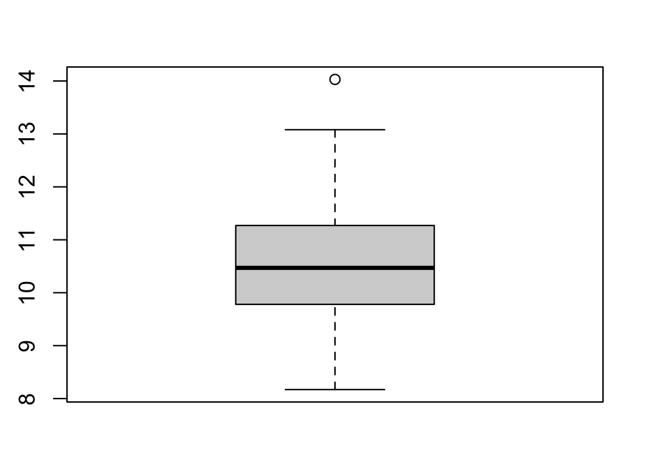

---
output:
  html_document: default
  pdf_document: default
---
\mainmatter

# Introduction to `R` and RStudio {#chapter1}


::: {.chapterintro}
Scientists seek to answer questions using rigorous methods and careful
observations. These observations – collected from the likes of field notes,
surveys, and experiments – form the backbone of a statistical investigation and
are called data. Statistics is the study of how best to collect, analyze, and
draw conclusions from data, and in this first chapter, we focus on both the
properties of data and on the collection of data. 
- _Introduction to Modern Statistics_, Mine Çetinkaya-Rundel & Jo Hardin
:::

This book is designed primarily for use in a second semester 
statistics course although it can also be
useful for researchers needing a quick review or ideas for using `R` for the
methods discussed in the text. As a text primarily designed for a second
statistics course, it presumes that you have had an introductory statistics
course. There are now many different varieties of introductory statistics from
traditional, formula-based courses (called "consensus" curriculum courses) to
more modern, computational-intensive courses that use randomization ideas to try to
enhance learning of basic statistical methods. We are not going to presume that
you have had a particular "flavor" of introductory statistics or that you had
your introductory statistics out of a particular text, just that you have had a
course that tried to introduce you to the basic terminology and ideas
underpinning statistical reasoning. We would expect that you are familiar with
the logic (or sometimes illogic) of hypothesis testing including null and
alternative hypothesis \index{hypothesis testing} and confidence interval
\index{confidence interval} construction and interpretation,
and that you have seen all of these concepts in a couple of basic situations. We
start with a review of these ideas in one and two group situations with a
quantitative response, something that you likely have seen before. 

\indent This text covers a wide array of statistical tools that are connected
through situation, methods used, or both. As we explore various techniques, look
for the identifying characteristics of each method -- what type of research
questions are being addressed (relationships or group differences, for example)
and what type of variables are being analyzed (quantitative or categorical). 
***Quantitative variables*** \index{quantitative} are made up of numerical
measurements that have meaningful units attached to them, so that averages of 
measurements make sense. For example, averages of student heights is meaningful, 
but averages of letter grades are not. ***Categorical variables*** 
\index{categorical} take on values that are categories or labels, such as 
letter grades. Additionally, you will need to carefully identify the 
***response*** \index{response} and ***explanatory*** \index{explanatory}
variables, where the study and variable characteristics should suggest which
variables should be used as the explanatory variables which may explain
variation in the response variable. Because this is an intermediate statistics
course, we will start to handle more complex situations (many explanatory
variables), while also providing tools for data wrangling and data visualization, 
complementing the more sophisticated statistical models required to handle these
situations. 

## Overview of methods {#section1-1}

After you are introduced to basic statistical ideas, a wide array of statistical
methods become available. The methods explored here focus on assessing 
(estimating and testing for) relationships between variables, sometimes when
controlling for or modifying relationships based on levels of another variable
-- which is where statistics gets interesting and really useful. Early
statistical analyses (approximately 100 years ago) were focused on describing a
single variable. Your introductory statistics course should have explored
methods for summarizing, visualizing, and doing inference in
situations with one group or where you were comparing results for two groups of
observations. Now, we get to consider more complicated situations -- culminating
in a set of tools for working with multiple explanatory variables, some of
which might be categorical and related to having different groups of subjects
that are being compared. Throughout all of the methods we will cover, it will be
important to retain a focus on how the appropriate statistical analysis depends
on the research question and data collection process as well as the types of
variables measured. 

\indent Figure \@ref(fig:Figure1-1) frames the topics we will discuss. Taking a broad
view of the methods we will consider, 
there are basically two scenarios -- one when the response is quantitative and
one when the response is categorical. Examples of quantitative responses we will
see later involve *passing distance of cars for a bicycle rider* (in centimeters)
and *body fat* (percentage). Examples of categorical variables include 
*improvement* (none, some, or marked) in a clinical trial related to arthritis
symptoms or whether a student has turned in copied work (never, done this on an
exam or paper, or both). There are going to be some more nuanced aspects to all
these analyses as the complexity of both sides of Figure \@ref(fig:Figure1-1)
suggest, but note that near the bottom, each tree converges on a single
procedure, using a ***linear model*** \index{model!linear} for a quantitative
response variable or using a ***Chi-square test*** for a categorical response.
\index{Chi-Square Test} After selecting the appropriate procedure and completing
the necessary technical steps to get results for a
given data set, the final step involves assessing the scope of inference 
\index{scope of inference} and
types of conclusions that are appropriate based on the design of the study. 

(ref:fig1-1) Flow chart of data analysis procedures.

<div class="figure" style="text-align: center">

<p class="caption">(\#fig:Figure1-1)(ref:fig1-1)</p>
</div>

\indent We will be spending most of the semester working on methods for quantitative
response variables (the
left side of Figure \@ref(fig:Figure1-1) is covered in Chapters \@ref(chapter2),
\@ref(chapter3), \@ref(chapter4), \@ref(chapter6), \@ref(chapter7), and
\@ref(chapter8)), stepping
over to handle the situation with a categorical response variable in Chapter
\@ref(chapter5) (right side of Figure \@ref(fig:Figure1-1)).
Chapter \@ref(chapter9) contains case studies
illustrating all the methods discussed previously, providing a final opportunity
to explore additional examples that illustrate how finding a
path through Figure \@ref(fig:Figure1-1) can lead to the appropriate analysis. 

\indent The first topics (Chapters \@ref(chapter1), and \@ref(chapter2)) will be
more familiar as we start with single and two group situations
with a quantitative response. In your previous statistics course, you should
have seen methods for estimating and quantifying uncertainty for the mean of a
single group and for differences in the means of two groups. Once we have
briefly reviewed these methods and introduced the statistical software that we
will use throughout the course, we will consider the first new statistical
material in Chapter \@ref(chapter3). It involves the situation with a
quantitative response variable where
there are more than 2 groups to compare -- this is what we call the ***One-Way
ANOVA*** situation. It generalizes the 2-independent sample hypothesis
test to handle situations where more than 2 groups are being studied. When we
learn this method, we will begin discussing model assumptions 
\index{assumptions} and methods for assessing those assumptions that will be
present in every analysis involving a
quantitative response. The ***Two-Way ANOVA*** (Chapter \@ref(chapter3))
considers situations with two categorical explanatory variables and a 
quantitative response. To make
this somewhat concrete, suppose we are interested in assessing differences in, 
say, the *yield* of wheat from a field based on the amount of *fertilizer*
applied (none, low, or high) and *variety* of wheat (two types). Here, *yield*
is a quantitative response variable that might be measured in bushels per acre
and there are two categorical explanatory variables, *fertilizer*, with three
levels, and *variety*, with two levels. In this material, we introduce the idea
of an ***interaction*** between the two explanatory variables: 
\index{interaction!Two-Way ANOVA} the relationship between one categorical
variable and the mean of the response changes depending on the levels of the
other categorical variable. For example, extra fertilizer might enhance the
growth of one variety and hinder the growth of another so we would say that 
*fertilizer* has different impacts based on the level of *variety*. Given this
interaction may or may not actually be present, we will consider two versions
of the model in Two-Way ANOVAs, \index{model!Two-Way ANOVA} what are called the
***additive*** \index{model!additive} (no interaction) and the ***interaction*** \index{model!interaction} models. 

\indent Following the methods for two categorical variables and a quantitative 
response, we explore a method for analyzing data where the response is
categorical, called the ***Chi-square test***
in Chapter \@ref(chapter5). This most closely matches the one-way ANOVA
situation with a single categorical explanatory variable, except now the
response variable is categorical. For example, we will assess whether taking a
drug (vs taking a ***placebo***^[A ***placebo*** is a treatment level designed
to mimic the potentially efficacious level(s) but that can have no actual
effect. The ***placebo effect*** is the effect that thinking that an effective
treatment was received has on subjects. There are other related issues in
performing experiments like the ***Hawthorne*** or ***observer effect*** where
subjects modify behavior because they are being observed.])
has an ***effect***^[We will reserve the term "effect" for situations where we
could potentially infer causal impacts on the response of the explanatory
variable which occurs in situations where the levels of the explanatory variable
are randomly assigned to the subjects.] on the type of improvement the subjects
demonstrate. There are two different scenarios
for study design that impact the analysis technique and hypotheses tested in
Chapter \@ref(chapter5). If the explanatory variable reflects the group that
subjects were
obtained from, either through randomization of the treatment level to the
subjects or by taking samples from separate populations, this is called a
***Chi-square Homogeneity Test***. \index{Chi-Square Test!Homogeneity Test} It
is also possible to obtain a single sample
from a population and then obtain information on the levels of the explanatory
variable for each
subject. We will analyze these results using what is called a 
***Chi-square Independence Test***. \index{Chi-Square Test!Independence Test}
They both use the same test statistic but we will use slightly different
graphics and are testing different hypotheses in these two related situations.
Figure \@ref(fig:Figure1-1) also shows that if we had a quantitative explanatory
variable and a categorical response that we could "bin" or create
categories of responses from the quantitative variable to use the Chi-square
testing methods. Alternatively, if we did not create categories from the 
quantitative explanatory variable, we would use a **Logistic Regression**. 
This type of data model will be covered in additional statistics classes, but 
has connections to the linear models discussed in this textbook.

\indent If the predictor and response variables are both quantitative, we start
with scatterplots, correlation, 
and ***simple linear regression*** models (Chapters \@ref(chapter6) and
\@ref(chapter7)) -- things you should have seen, at least to some degree, in 
your introductory statistics course. The biggest differences here will be
the depth of exploration of diagnostics and inferences for this model and
discussions of transformations of variables included in the model. 
\index{transformation} If there is more than one explanatory variable, then we
say that we are performing a ***multiple linear regression***
(Chapter \@ref(chapter8)) -- where the "multiple" part of the procedure reflects
the inclusion of more than one explanatory variable in the model. We use the
same procedure if we have a mix of categorical and quantitative predictor
variables but there are some new issues in setting up the models and
interpreting the coefficients that we will need to consider. In the situation
with one categorical predictor and one quantitative predictor, we will revisit
the idea of an interaction. \index{interaction!MLR} 
An interaction allows us to consider situations
where the estimated relationship between a quantitative predictor and the 
mean response
varies across different levels of the categorical variable. In Chapter 
\@ref(chapter9), connections among all the methods used for quantitative
responses are discussed, showing that they all have the same foundation,
beacause they are all linear models \index{model!linear}. We also show how the
methods discussed can be applied to a suite of new problems using a set of case
studies and how that relates to further extensions of the methods.

\indent By the end of Chapter \@ref(chapter9) you should be able to identify,
perform using the statistical software `R` [@R-base], and interpret the results 
from each of these methods. There
is a lot to learn, but many of the tools for using `R` and interpreting results
of the analyses accumulate and repeat throughout the textbook. If you work hard
to understand the initial methods, it will help you when the methods get more
complicated. You will likely feel like you are just starting to learn how to
use `R` at the end of the semester and for learning a programming language that
is a big accomplishment! We will be taking you on the first steps of a
potentially long journey and it is up to you to decide how much further you
want to go with learning the software for wrangling, visualizing, and modeling 
data. 

\indent All the methods you will learn require you to carefully consider how the
data were collected, how that
pertains to the population of interest, and how that impacts the inferences
that can be made. The ***scope of inference*** from the bottom of Figure
\@ref(fig:Figure1-1) is our shorthand term for remembering to think about two
aspects of the study -- ***random assignment*** and ***random sampling***.
\index{random assignment} \index{random sampling} In a given
situation, you need to use the description of the study to decide if the
explanatory variable was randomly assigned to the study units (this allows for
***causal inferences*** \index{causal effect} if differences are detected) or 
not (where no causal statements are possible). As an example, think about two
studies, one where students are
randomly assigned to either get tutoring with their statistics course or not
and another where the students are asked at the end of the semester whether
they sought out tutoring or not. Suppose we compare the final grades in the
course for the two groups (tutoring/not) and find a big difference. In the
first study where students were randomly assigned to receive tutoring,
\index{random assignment} we can say the tutoring *caused* the
differences we observed. In the second, we could only say that the tutoring was
*associated* with differences. Because students self-selected the group they
ended up in, we can't say that the tutoring caused the differences. The other
aspect of scope of inference concerns random sampling: \index{random sampling} 
If the data were obtained using a random sampling mechanism, then our inferences
can be safely extended to the population that the sample was taken from.
However, if we have a non-random
sample, our inference can only apply to the sample collected. In the previous
example, the difference would be studying a random sample of students from the
population of, say, Introductory Statistics students at a university versus
studying a sample of students that volunteered for the research project, maybe
for extra credit in the class. We could still randomly assign them to
tutoring/not but the non-random sample would only lead to conclusions about
those students that volunteered. The most powerful scope of inference is when
random assignment is used in a random sample from a population -- conclusions
would be about causal impacts that we would expect to happen in the population. 

\indent By the end of this material, you should have some `R` skills to wrangle 
data in preparation for analysis, create professional quality data
visualizations, and the ability to fit ANOVA and regression models to data, as
well as to handle Chi-square testing situations. Together, this should prepare
you for future statistics courses or for other
situations where you are expected to be able to identify an appropriate
analysis, do the calculations and required graphics using the data set, and then
effectively communicate interpretations for the methods discussed here. 

## Getting started in `R` {#section1-2}

You will need to download the statistical software package called `R` and an
enhanced interface to R called RStudio [@RStudio]. These are both open source
and free to download and use (and will always be that way). This means that the
skills you learn now can follow you the rest of your life. `R` is becoming the
primary language of statistics and is being adopted across academia, government,
and businesses to help manage and learn from the growing volume of data being
obtained. Hopefully you will get a sense of some of the power of `R` in this
book. 

\indent The next pages will walk you through the process of getting the software
downloaded and provide you with
an initial experience using RStudio to do things that should look familiar
even though the interface will be a new experience. Do not expect to master `R`
quickly -- it takes years (sorry!) even if you know the statistical methods
being used. We will try to keep all your interactions with `R` code in a similar
code format and that should help you in learning how to use `R` as we move
through various methods. We will also often provide you with example code.
Everyone that learns `R` starts with copying other people's code and then making
changes for specific applications -- so expect to go back to examples from the
text and focus on learning how to modify that code to work for your particular
data set. Only really experienced `R` users "know" functions without having to
check other resources. After we complete this basic introduction, Chapter 
\@ref(chapter2) starts the exploration of more sophisticated tasks in `R`,
allowing us to compare quantitative responses from two groups, make some
graphical displays, do hypothesis testing \index{hypothesis testing} and create
confidence intervals in a couple of different ways. 

\indent You will have two^[There is a cloud version of R Studio available at 
https://rstudio.cloud/ that is free for limited usage. We recommend following 
the steps to be able to work locally but try this option if you have issues with 
the installation process and need to complete an assignment or two until you get
the installation sorted out.] downloading activities to complete before
you can do anything more than read this book^[I created this interactive website (https://greenwood-stat.shinyapps.io/InstallDemo/) that contains discussions and
activities related to installing and using R and RStudio.]. First, you need to
download `R`. It is the engine that will do all the computing
for us, but you will only interact with it once. Go to http://cran.rstudio.com
and click on the "**Download R for...**" button that
corresponds to your operating system. On the next page, click on "**base**" and
then it will take you to a screen to download the most current version of `R` 
that is compiled for your operating system, something like 
"**Download R 4.0.2 for Windows**". Click on that link and then open the file
you downloaded. You will need to select your preferred language (choose English
so your instructor can help you), then hit "**Next**" until it starts to unpack
and install the program (all the base settings will be fine). After you hit
"**Finish**" you will not do anything further with `R` directly. 

\indent Second, you need to download RStudio. RStudio is an integrated 
development enviroment (IDE), which means it provides an enhanced interface that
will make interacting with `R` less frustrating and allow you to directly create
reports that include the code and output. To download RStudio, go near the
bottom of <https://www.rstudio.com/products/rstudio/download/> and select the
correct version under "Installers for Supported Platforms" for your operating
system. Download and then install RStudio using the installer. From this point
forward, you should only open RStudio; it provides your interface with `R`. 
Note that both `R` and RStudio are updated frequently (up to four times a year) 
and if you downloaded either more than a few months previously, you should
download the up-to-date versions, especially if something you are trying to do
is not working. Sometimes code will not work in older versions of `R` and
sometimes old code won't work in new versions of `R`.^[The need to keep the code
up-to-date as `R` continues to evolve is one reason that this book is locally
published and that this is the 7^th^ time it has been revised in seven years...]
 
(ref:fig1-2) Initial RStudio layout.

<div class="figure" style="text-align: center">

<p class="caption">(\#fig:Figure1-2)(ref:fig1-2)</p>
</div>

\indent To get started, we can complete some basic tasks in `R` using the
RStudio interface. When you open RStudio, you will see a screen like Figure 
\@ref(fig:Figure1-2). The
added annotation in this and the following screen-grabs is there to help you
get initially oriented to the software interface. R is command-line software --
meaning that in some way or another you have to create code and get it
evaluated, either by entering to be executed (run) in the command prompt (in the 
bottom left-hand panel) or by creating a document to store the code, and 
executing the code from that file. RStudio makes the management and
execution of that code more efficient than the basic version of `R`. 

In RStudio, the lower left panel is called the "console" window, and is where
all of the action happens. Every time you launch RStudio, it will have the same
text at the top of the console telling you the version of R that you're running. 
Below that information is the *prompt*, indicated by the `>` symbol.
As its name suggests, this prompt is really a request: a request for a command.
Initially, interacting with `R` is all about typing commands and interpreting
the output. These commands and their syntax have evolved over decades
(literally) and now provide what many users feel is a fairly natural way to
access data and organize, describe, and invoke statistical computations.

The upper left panel is for writing, saving, and running your `R` code either in
`R` script (.R) files or R Markdown (.Rmd) files. The panel in the upper right
contains your *environment* as well as a history of the commands that you've
previously entered. It also contains the "Import Dataset" button that provides
the easiest way for you to read a data set into `R` so you can analyze it.

The panel in the lower right contains tabs for browse the *files* in your
project folder, access *help* files for `R` functions, install and manage
`R` *packages*, and inspecting visualizations. By default, all data
visualizations you make will appear directly below the code you used to create
them. If you would rather your plots appear in the *plots* tab, you will need to
change your global options.

<!-- RUNNING CODE -->
<!-- Once you have code available -->
<!-- in this window, the "Run" button will execute the code for the line that your  -->
<!-- cursor is on or for any text that you -->
<!-- have highlighted with your mouse. -->

<!-- Going forward you should refrain from typing your code directly in the console, as this makes it very difficult to remember and reproduce the output you want to reference. -->
<!-- Potentially the most important feature of R Markdown files is that they allow for us to nest our `R` code within a written report. -->
<!-- In an R Markdown file, `R` code appears in a gray box, which we call "code chunks." The R Markdown file knows that the gray box contains `R` code because it begins with three tick marks (\`\`\`), followed by two curly braces that contain a lowercase letter r ({r}). -->
<!-- You've already seen this above! -->

<!-- Instead of typing our `R` code into the console, we encourage you to type any code you produce (final correct answer, or anything you're just trying out) in the `R` code chunk associated with each problem. -->
<!-- You can execute the `R` code you type in these code chunks similar to how you typed code into the console and pressed enter/return. -->
<!-- Within the code chunk there are two ways to execute a line of `R` code: (1) place your cursor on the line on code and press `Ctrl-Enter` or `Cmd-Enter` at the same time, or (2) place your cursor on the line and press the "Run" button in the upper right hand corner of the R Markdown file. -->
<!-- Alternatively, if you wanted to run all of the `R` code in a given code chunk, you can click on the "Play" button in the upper right hand corner of the code chunk (green sideways triangle). -->

<!-- If at any point you need to start over and run all of the code chunks before a specific code chunk, you click on the "Fastforward" button in the upper right hand corner of that code chunk (gray upside down triangle with a bar below). -->
<!-- This will run every code chunk that occurred *before* that code chunk, but *will not* execute the `R` code included in that code chunk. -->

### Using `R` as a Big Calculator

\indent As a first interaction with `R` we can use it as a very powerful
calculator. To do this, click near the command prompt (`>`) in the lower left
"console" panel, type `3+4`, and then hit enter. It should look like this:


```r
3+4
```

```
## [1] 7
```

You can do more interesting calculations, like finding the mean of a set of 
numbers, say -3, 5, 7, and 8, You can do this by adding the numbers up and 
dividing by 4: 


```r
(-3+5+7+8)/4
```

```
## [1] 4.25
```

Note that the parentheses help `R` to figure out your desired order of
operations. If you drop that grouping, you get a very different (and wrong!) 
result:


```r
-3+5+7+8/4
```

```
## [1] 11
```

We could the use a formula from introductory statistics to estimate the standard
deviation of this set of numbers, but that gets us away from the reason we are 
using `R`. To use the real power of `R` in this course, we need to work with
data sets that store observations for our subjects as *variables*, where 
each subject's information is stored in a different row. 

In `R`, data frames are the _de facto_ data structure, and what
we use for data processing, statistics, and plotting. A data frame is the
representation of data in the format of a table where the columns are vectors
that all have the same length. Data frames are analogous to the more familiar
spreadsheet in programs such as Excel, with one key difference. Because columns
are vectors, each column must contain a single type of data (e.g., characters,
integers, factors). For example, here is a figure depicting a data frame
comprising a numeric, a character, and a logical vector.

(ref:fig1-3) Dataframe structure.

<div class="figure" style="text-align: center">

<p class="caption">(\#fig:Figure1-3)(ref:fig1-2)</p>
</div>

What we will call "tidy" dataframes, are dictated by three main rules:

1. Each variable has its own column
2. Each observation has its own row
3. Each value must have its own cell

A data frame can be created by hand, but most commonly they are generated by the
functions `read_csv()` or `read_table()`. But, we are going to start by working 
with the building blocks of datafames: vectors. 

Every column of a dataframe contains a vector of observations. To create a
vector we use the concatenate function (`c()`), which binds together a list of 
numbers to form a vector. For example, running the code `c(1, 2, 3, 4)`, would 
output a vector of four numbers, 1, 2, 3, and 4. 


```r
c(-3, 5, 7, 8)
```

```
## [1] -3  5  7  8
```

If we would like store this vector into a variable, so we can refer back to it,
we will need to assign it to a variable, like *`variable1`*. To get a vector
stored in a variable we need to use the assignment operator,
`<-` (read as "is defined to contain") that assigns the object on the right
into the variable that you are creating on the left. 


```r
variable1 <- c(-3, 5, 7, 8)
```

In `R`, the assignment operator, ``<-``, is created by typing a "less than"
symbol ``<`` followed by a "minus" sign (``-``) 
**without a space between them**. If you ever want to see what numbers are
residing in an object in `R`, just type its name in the console and hit *enter*.
You can see how that variable contains the same information that was initially
generated by ``c(-3, 5, 7, 8)`` but is easier to access since we just need the
text for the variable name representing that vector. 


```r
variable1
```

```
## [1] -3  5  7  8
```

::: {.protip}
`R` is case sensitive! `Variable1` is not the same as `variable1`!
:::

Once we have created a variable, we can start to explore functions we can use 
to summarize the contents of the vector. 

### Functions and their arguments

Functions can be thought of as "prepackaged scripts" that automate more
complicated sets of commands. Many functions are what we call "base" functions, 
meaning they come automatically installed when you download `R`. Other 
functions are made available by importing `R` *packages*, which we will explore 
later. 

A function usually gets one or more inputs called *arguments*, and often (but
not always) return a *value* called an *output*. A typical example would be the
function `mean()`. The input (the argument) must be numbers, and the return
value (in fact, the output) is the mean of those numbers. Executing a function
('running it') is called *calling* the function. An example of a function call
is:


Here, the `variable1` is the input to the `mean()` function, which the 
`mean()` function uses to calculates the mean of that input, and then returns
the value which is then assigned to the object `mean_var1`. This function is
very simple, because it only has one required argument.

\index{mean}

The return 'value' of a function need not be numerical (like that of `mean()`),
and it also does not need to be a single item: it can be a set of things, or
even a dataset. We'll see that when we read data files into `R`.

Arguments can be anything, not only numbers or filenames, but also other
objects. Exactly what each argument means differs per function, and must be
looked up in the documentation (see below). Some functions take arguments which
may either be specified by the user, or, if left out, take on a *default* value:
these are called *options*. Options are typically used to alter the way the
function operates, such as whether it ignores 'bad values', or what symbol to
use in a plot.  However, if you want something specific, you can specify a value
of your choice which will be used instead of the default.

### Missing Values 

Let's explore some of the options in the `mean()` function. Say your vector 
contained missing values, or `NA` values. If we use the `mean()` function as 
we did before, we will no longer obtain a numeric output if our vector contains 
`NA` values. 


```r
a <- c(-3, 5, 7, 8, NA)
mean(a)
```

```
## [1] NA
```

When doing operations on numbers, most functions will return `NA` if the data
you are working with include missing values. This feature makes it harder to
overlook missing data.


If we want to know if we can omit the missing values when finding the mean, we 
can look at the help file for the `mean()` function using `?round`.


We see that the `mean()` function has an `na.rm` argument that allows for us to 
omit `NA`s when calculating the mean. Notice, this argument defaults to a value 
of `FALSE`, meaning the option is turned off. If you want to turn the option on, 
you need to tell `R` that you wish for `na.rm` to be `TRUE`. 


```r
mean(a, na.rm = TRUE)
```

```
## [1] 4.25
```

\indent When dealing with real data, we will often have information about more than one
variable. We could enter all observations by hand for each variable but this is
prone to error and onerous for all but the smallest data sets. If you are to
ever utilize the power of statistics in the evolving data-centered world, data
management has to be accomplished in a more sophisticated way. While you can
manage data sets quite effectively in R, it is often easiest to start with your
data set in something like Microsoft Excel or OpenOffice's Calc. You want to
make sure that observations are in the rows and the names of variables are in
first row of the columns and that there is no "extra stuff" in the spreadsheet. If you have
missing observations, they should be represented with blank cells. The file should
be saved as a ".csv" file (stands for comma-separated values although Excel
calls it "CSV (Comma Delimited)"), which basically strips off some of the junk
that Excel adds to the necessary information in the file. Excel will tell you that
this is a bad idea, but it actually creates a more stable archival format and
one that R can use directly.^[There are ways to read ".xls" and ".xlsx" files 
directly into R that we will explore later so you can also use that format if you prefer.]

\indent The following code to read in the data set relies on an R package called 
``readr`` [@R-readr]. Packages in R provide additional functions and data sets that 
are not available in the initial download of R or RStudio. To get access to the packages, 
first "install" (basically
download) and then "load" the package. To install an R package, go to the **Packages** 
tab in the lower right panel of
RStudio. Click on the **Install** button and then type in the name of the package in
the box (here type in ``readr``). 
\index{R packages!\textbf{readr}}
RStudio will try to auto-complete the package name
you are typing which should help you make sure you got it typed correctly. If you are working in a .Rmd file, a highlighted message may show up on the top of the file to suggest packages to install that are not present -- look for this to help make sure you have the needed packages installed. This will
be the first of *many* times that we will mention that R is case sensitive -- in
other words, ``Readr`` is different from ``readr`` in R syntax and this sort of
thing applies to everything you do in R. You should only need to install each R
package once on a given computer. If you ever see a message that R can't find a
package, make sure it appears in the list in the **Packages** tab. If it 
doesn't, repeat the previous steps to install it. 

---------------------------------------------------------------------------
**Important**: R is case sensitive! ``Readr`` is not the same as ``readr``!
---------------------------------------------------------------------------

\indent After installing the package, we need to load it to make it active in a given work
session. Go to the command prompt and type (or copy and paste) ``library(readr)`` or ``require(readr)``:
\index{R packages!\textbf{readr}}

```
> library(readr)
```

With a data set converted to a CSV file and ``readr`` installed and loaded, we need to read the data set into the active workspace. 
\index{import data}
There are two ways to do this, either using the point-and-click GUI in RStudio (click
the "Import Dataset" button in the upper right "Environment" panel as
indicated in Figure \@ref(fig:Figure1-2)) or modifying the ``read_csv`` 
function to find the file of interest. To practice this, you can 
download an Excel (.xls) file from
http://www.math.montana.edu/courses/s217/documents/treadmill.xls 
that contains observations on 31 males that volunteered for a study on methods 
for measuring fitness [@Westfall1993]. 
In the spreadsheet, you will find a data set that
starts and ends with the following information (only results for Subjects 1, 2, 
30, and 31 shown here):

----------------------------------------------------------------------------
Sub-   Tread-    TreadMill-   RunTime  RunPulse  Rest    BodyWeight   Age
ject   MillOx    MaxPulse                        Pulse
-----  --------  -----------  -------  --------  ------  -----------  ----
1      60.05     186          8.63     170       48      81.87        38

2      59.57     172          8.17     166       40      68.15        42

…      …         …            …        …         …       …            …

30     39.2      172          12.88    168       44      91.63        54

31     37.39     192          14.03    186       56      87.66        45
----------------------------------------------------------------------------

\indent The variables contain information on the subject number (*Subject*), subjects' 
maximum treadmill oxygen consumption (*TreadMillOx*, in ml per kg per minute, also called maximum VO2) and 
maximum pulse rate (*TreadMillMaxPulse*, in beats per minute), time to run 1.5
miles (*Run Time*, in minutes), maximum pulse
during 1.5 mile run (*RunPulse*, in beats per minute), resting pulse rate 
(*RestPulse*, beats per minute), Body Weight (*BodyWeight*, in kg), and *Age* 
(in years). Open the file in Excel or equivalent software and then save it as 
a .csv file in a location you can find on your computer. Then go to RStudio 
and click on **File**, then **Import Dataset**, then **From Text (readr)...**^[If
you are having trouble getting the file converted and read into R, copy and 
run the following code: 
``treadmill <- read_csv("01/data/treadmill.csv")``.] 
\index{import data}
Click "**Import**" and find your file. R will store the data set as an object with the same name 
as the .csv file. You could use another name as well, but it is 
often easiest just to keep the data
set name in R related to the original file name. You should see some text appear
in the console (lower left panel) like in Figure \@ref(fig:Figure1-3). The text 
that is created
will look something like the following -- if you had stored the file in a drive
labeled D:, it would be:


What is put inside the 
``" "`` will depend on the location and name of your saved .csv file. A 
version of the data set in what looks like a
spreadsheet will appear in the upper left window due to the second line of 
code (``View(treadmill``)). 

(ref:fig1-4) RStudio with initial data set loaded.

<div class="figure" style="text-align: center">

<p class="caption">(\#fig:Figure1-4)(ref:fig1-3)</p>
</div>

\indent Just directly typing (or using) a line of code like this is actually the 
other way that we can read in
files. If you choose to use the text-only interface, then you need to tell R
where to look in your computer to find the data file. ``read_csv`` is a 
function that takes a path as an argument. To use it, specify the path to 
your data file, put quotes around it, and put it as the input to 
``read_csv(...)``. For some examples later in the book, you will be able to 
copy a command like this from the text and read data sets and other
code directly from the website, assuming you are connected to the
internet. 

\indent To verify that you read the data set in correctly, it is always good to check 
its contents. We can view the first and last rows in the data set using the 
``head`` and ``tail`` functions on the data set, which show the following 
results for the
``treadmill`` data. Note that you will sometimes need to resize the console
window in RStudio to get all the columns to display
in a single row which can be performed by dragging the gray bars that separate
the panels.
\index{\texttt{head()}}
\index{\texttt{tail()}}

\small

```r
> head(treadmill)
# A tibble: 6 x 8
  Subject TreadMillOx TreadMillMaxPulse RunTime RunPulse RestPulse BodyWeight   Age
    <int>       <dbl>             <int>   <dbl>    <int>     <int>      <dbl> <int>
1       1       60.05               186    8.63      170        48      81.87    38
2       2       59.57               172    8.17      166        40      68.15    42
3       3       54.62               155    8.92      146        48      70.87    50
4       4       54.30               168    8.65      156        45      85.84    44
5       5       51.85               170   10.33      166        50      83.12    54
6       6       50.55               155    9.93      148        49      59.08    57

> tail(treadmill)
# A tibble: 6 x 8
  Subject TreadMillOx TreadMillMaxPulse RunTime RunPulse RestPulse BodyWeight   Age
    <int>       <dbl>             <int>   <dbl>    <int>     <int>      <dbl> <int>
1      26       44.61               182   11.37      178        62      89.47    44
2      27       40.84               172   10.95      168        57      69.63    51
3      28       39.44               176   13.08      174        63      81.42    44
4      29       39.41               176   12.63      174        58      73.37    57
5      30       39.20               172   12.88      168        44      91.63    54
6      31       37.39               192   14.03      186        56      87.66    45
```
 
\normalsize

\indent When you load an installed package with ``library``, you may see a warning message about versions of the package and versions of 
R -- this is *usually* something you can ignore. Other warning messages could
be more ominous for proceeding but before getting too concerned, there are 
couple of basic things to check. 
\index{warning message}
First, double check that the package is 
installed (see
previous steps). Second, check for typographical errors in your code --
especially for mis-spellings or unintended capitalization. If you are still
having issues, try repeating the installation process. Then click on the "**Update**" button to check for potentially newer versions of packages. If all that fails, try the cloud version of RStudio discussed before and repeat the steps there. 

\indent To help you go from basic to intermediate R usage and especially to help with more
complicated problems, you will want to learn how to manage and save your R code. 
The best way to do this is using the upper left panel in RStudio. If you just want to manage code, then you can use what
are called R Scripts, which are files that have a file extension of ".R". To
start a new ".R" file to store your code, click on **File**, then 
**New File**, then **R Script**. This will create a blank page to enter and 
edit code -- then save the file as something like "MyFileName.R" in your preferred location. 
Saving your code will mean that you can return to where you
were working last by simply re-running the saved script file. With code in the
script window, you can place the cursor on a line of code or highlight a chunk
of code and hit the "Run" button^[You can also use Ctrl+Enter if you like hot keys.] 
on the upper part of the panel. It will appear
in the console with results just like what you would obtain if you typed it
after the command prompt and hit enter for each line. Figure \@ref(fig:Figure1-4) 
shows the screen with the code used in this 
section in the upper left panel, saved in
a file called "Ch1.R", with the results of highlighting and executing the first
section of code using the "Run" button. 

(ref:fig1-5) RStudio with highlighted code run.

<div class="figure" style="text-align: center">

<p class="caption">(\#fig:Figure1-5)(ref:fig1-4)</p>
</div>

## Basic summary statistics, histograms, and boxplots using R {#section1-3}

For the following material, you will need to install and load the ``mosaic`` package [@R-mosaic]. 

\index{R packages!\textbf{mosaic}}

```r
> library(mosaic)
```

It provides a suite of enhanced functions to aid our initial explorations. With RStudio running, the ``mosaic`` package loaded, a place to write and
save code, and the ``treadmill`` data set loaded, we can (finally!) start to
summarize the results of the study. The ``treadmill`` object is what R calls a 
***tibble***^[Tibbles are R objects that can contain both 
categorical and quantitative variables on your $n$ subjects with a name for each
variable that is also the name of each column in a matrix. \index{tibble} Each subject is a 
row of the data set. The name (supposedly) is due to the way *table* sounds in the accent of a particularly influential developer at RStudio who is from New Zealand.] and contains columns corresponding to each variable in 
the spreadsheet. Every
function in R will involve specifying the variable(s) of interest and how you
want to use them. To access a particular variable (column) in a tibble, you
can use a $ between the name of the tibble and the name of the variable of
interest, generically as ``tibblename$variablename``. You can think of this as *tibblename's variablename* where the *'s* is replaced by the dollar sign. To identify the 
``RunTime`` variable here it would be ``treadmill$RunTime``. In the command line it would look like:

```r
> treadmill$RunTime
[1]  8.63  8.17  8.92  8.65 10.33  9.93 10.13 10.08  9.22  8.95 10.85  9.40 11.50 10.50
[15] 10.60 10.25 10.00 11.17 10.47 11.95  9.63 10.07 11.08 11.63 11.12 11.37 10.95 13.08
[29] 12.63 12.88 14.03
```

\indent Just as in the previous section, we can generate summary statistics using functions like ``mean`` and ``sd`` by running them on a specific variable:
\index{mean}
\index{standard deviation}

```r
> mean(treadmill$RunTime)
[1] 10.58613
> sd(treadmill$RunTime)
[1] 1.387414
```
And now we know that the average running time for 1.5 miles for the subjects in the study was 10.6 minutes with a standard deviation (SD) of 1.39 minutes. But you should remember that the
mean and SD are only appropriate summaries if the distribution is roughly
***symmetric*** (both sides of the distribution are approximately the same shape and length). The 
``mosaic``  package provides a useful function called ``favstats`` that provides 
the mean and SD as well as the ***5 number summary***: \index{5 number summary}
the minimum (``min``), the first quartile (``Q1``, the 25^th^ percentile), 
the median (50^th^ percentile), the third quartile (``Q3``, the 75^th^
percentile), and the maximum (``max``). It also provides the number of 
observations (``n``) which was 31, as noted above, and a count of whether any 
missing values were encountered (``missing``), which was 0 here since all 
subjects had measurements available on this variable. 
\index{favstats}

```r
> favstats(treadmill$RunTime)
  min   Q1 median    Q3   max     mean       sd  n missing
 8.17 9.78  10.47 11.27 14.03 10.58613 1.387414 31       0
```

\indent We are starting to get somewhere with understanding that the runners were 
somewhat fit with the worst runner covering 1.5 miles in 14 minutes 
(the equivalent of a 9.3 minute mile)
and the best running at a 5.4 minute mile pace. The limited variation in the
results suggests that the sample was obtained from a restricted group with
somewhat common characteristics. When you explore the ages and weights of the
subjects in the Practice Problems in Section \@ref(section1-6), you will get even more
information about how similar all the subjects in this study were. Researchers often publish numerical summaries of this sort of demographic information to help readers understand the subjects that they studied and that their results might apply to.

\indent A graphical display of these results will help us to assess the shape 
of the distribution of run times -- including considering the potential for the presence of a ***skew*** (whether the right or left tail of the distribution 
is noticeably more spread out, with left skew meaning that the left tail 
is more spread out than the right tail) \index{skew} and ***outliers*** \index{outlier}
(unusual observations). A ***histogram*** \index{histogram} is a good place to start.
Histograms display connected bars with counts of observations defining
the height of bars based on a set of bins of values of the quantitative variable. 
We will apply the ``hist`` function to the ``RunTime`` variable, which produces 
Figure \@ref(fig:Figure1-6). 

```r
> hist(treadmill$RunTime)
```

(ref:fig1-6) Histogram of Run Times (minutes) of $n$=31 subjects in Treadmill study, bar heights are counts.

<div class="figure">

<p class="caption">(\#fig:Figure1-6)(ref:fig1-5)</p>
</div>

(ref:fig1-7) RStudio while in the process of copying the histogram.

<div class="figure" style="text-align: center">

<p class="caption">(\#fig:Figure1-7)(ref:fig1-6)</p>
</div>

\indent You can save this plot by clicking on the **Export** button found above 
the plot, followed by **Copy to Clipboard** and clicking on the 
**Copy Plot** button. Then if you open your
favorite word-processing program, you should be able to paste it into a
document for writing reports that include the figures. You can see the first
parts of this process in the screen grab in Figure \@ref(fig:Figure1-6). You can also directly save the figures as separate files using 
**Save as Image** or **Save as PDF** and then insert them into your word 
processing documents. 

\indent The function ``hist`` defaults into providing a histogram on the ***frequency***
(count) scale. In most R functions, there are the default options that will 
occur if we don't make any specific choices but we
can override the default options if we desire. One option we can modify here is
to add labels to the bars to be able to see exactly how many observations fell
into each bar. Specifically, we can turn the ``labels`` option "on" by making it true ("T") by adding ``labels=T`` to the previous call to the ``hist`` function, separated by a comma. Note that we will use the ``=`` sign only for changing options within functions.  

```r
> hist(treadmill$RunTime, labels=T)
```

(ref:fig1-8) Histogram of Run Times with counts in bars labeled.

<div class="figure">

<p class="caption">(\#fig:Figure1-8)(ref:fig1-7)</p>
</div>


\indent Based on this histogram (Figure \@ref(fig:Figure1-8)), it does not appear that there any outliers in the responses
since there are no bars that are separated from the other observations. However, 
the distribution does not look symmetric and there might be a skew to the
distribution. Specifically, it appears to be ***skewed right*** (the right tail is longer than the left). But histograms can sometimes mask features of
the data set by binning observations and it is hard to find the percentiles
accurately from the plot. 

\indent When assessing outliers and skew, the ***boxplot*** 
(or *Box and Whiskers* plot) can also be helpful (Figure \@ref(fig:Figure1-8)) to describe the 
shape of the distribution as it displays the 5-number summary and will also indicate
observations that are "far" above the middle of the observations. 
\index{boxplot}
R's ``boxplot`` function uses the standard rule to indicate an observation as a
***potential outlier*** if it falls more than 1.5 times the ***IQR*** 
(Inter-Quartile Range, calculated as Q3 -- Q1) below Q1 or above Q3. 
\index{outlier}
The potential outliers 
are plotted with circles and the *Whiskers* (lines that extend from Q1 and Q3 typically to 
the minimum and maximum) are shortened to only go as far as
observations that are within $1.5*$IQR of the upper and lower quartiles. The *box*
part of the boxplot is a box that goes from Q1 to Q3 and the median is displayed as a line 
somewhere inside the box.^[The median, quartiles and whiskers sometimes occur at the same 
values when there are many tied observations. If you can't see all the 
components of the boxplot, produce the numerical summary to help you understand 
what happened.] Looking back at the summary statistics above, Q1=9.78 and Q3=11.27, providing an IQR of:

```r
> IQR <- 11.27 - 9.78
> IQR
[1] 1.49
```

One observation (the maximum value of 14.03) is indicated as a potential outlier 
based on this result by being larger than Q3 $+1.5*$IQR, which was 13.505:

```r
> 11.27 + 1.5*IQR
[1] 13.505
```

\indent The boxplot also shows a slight indication of a right skew (skew towards
larger values) with the distance from the minimum to the median being smaller than the
distance from the median to the maximum. Additionally, the distance from Q1 to
the median is smaller than the distance from the median to Q3. It is modest skew,
but worth noting. 

(ref:fig1-9) Boxplot of 1.5 mile Run Times.

<div class="figure">

<p class="caption">(\#fig:Figure1-9)(ref:fig1-8)</p>
</div>

```r
> boxplot(treadmill$RunTime)
```

\indent While the default boxplot is fine, it fails to provide good graphical labels, 
especially on the y-axis. Additionally, there is no title on the plot. The
following code provides some enhancements to the plot by using the ``ylab`` and 
``main`` options in the call to ``boxplot``, with the results displayed in
Figure \@ref(fig:Figure1-9). When we add text to plots, it will be contained within quotes and
be assigned into the options ``ylab`` (for y-axis) or ``main``
(for the title) here to put it into those locations. 

(ref:fig1-10) Boxplot of Run Times with improved labels.

<div class="figure">

<p class="caption">(\#fig:Figure1-10)(ref:fig1-9)</p>
</div>

```r
> boxplot(treadmill$RunTime, ylab="1.5 Mile Run Time (minutes)", 
          main="Boxplot of the Run Times of n=31 participants")
```

\indent Throughout the book, we will often use extra options to make figures that
are easier for you to understand. There
are often simpler versions of the functions that will suffice but the extra
work to get better labeled figures is often worth it. I guess the point is that
"a picture is worth a thousand words" but in data visualization, that is only
true if the reader can understand what is being displayed. It is also important
to think about the quality of the information that is being displayed, 
regardless of how pretty the graphic might be. So maybe it is better to say 
"a picture can be worth a thousand words" if it is well-labeled?

\indent All the previous results were created by running the R code and then copying the
results from either the console or by copying the figure and then pasting the results 
into the typesetting program. There is another way
to use RStudio where you can have it compile the results (both output and
figures) directly into a document together with other writing and the code that generated it, 
using what is called R Markdown (http://shiny.rstudio.com/articles/rmarkdown.html). 
It is basically what we used to prepare this book and what you should learn to use to do your work. 
From here forward, you will see a
change in formatting of the R code and output as you will no
longer see the command prompt (">") with the code. The output will be
flagged by having two "##"'s before it. For example, the summary statistics for
the *RunTime* variable from ``favstats`` function would look like when run using R Markdown:


```
##   min   Q1 median    Q3   max     mean       sd  n missing
##  8.17 9.78  10.47 11.27 14.03 10.58613 1.387414 31       0
```

\indent Statisticians (and other scientists) are starting to use R Markdown and similar methods 
because they provide what is called "Reproducible
research" [@Gandrud2015] where all the code and output it produced are
available in a single place. This allows different researchers to run and verify
results (so "reproducible results") or the original researchers to revisit their earlier work at a later
date and recreate all their results exactly. Scientific publications are currently
encouraging researchers to work in this way and may someday require it. The term ***reproducible*** can also be related to whether repeated studies get the same result (also called ***replication***) -- further discussion of these terms and the implications for scientific research are discussed in Chapter \@ref(chapter2).

\indent In order to get some practice using R Markdown, create a sample document in this format using File -> New File -> R Markdown... Choose a title for your file and select the "Word" option. This will create a new file in the upper left window where we stored our .R script. Save that file to your computer. Then you can use the "Knit" button to have RStudio run the code and create a word document with the results. R Markdown documents contain basically two components, "code chunks" that contain your code and the rest of the document where you can write descriptions and interpretations of the results that code generates. The code chunks can be inserted using the "Insert" button by selecting the "R" option. Then write your code in between the `` ```{r} `` and `` ``` `` lines (it should have grey highlights for those lines and white for the rest of the portions of the .Rmd document). Once you write some code inside a code chunk, you can test your code using the triangle on the upper right side of it to run all the code that resides in that chunk. Keep your write up outside of these code chunks to avoid code errors and failures to compile. Once you think your code and writing is done, you can use the "Knit" button to try to compile the file. As you are learning, you may find this challenging, so start with trying to review the sample document and knit each time you get a line of code written so you know when you broke the file. Also look around for posted examples of .Rmd files to learn how others have incorporated code with write-ups. You might even be given a template of homework or projects as .Rmd files from your instructor. After you do this a couple of times, you will find that the challenge of working with markdown files is more than matched by the simplicity of the final product and, at least to researchers, the reproducibility and documentation of work that this method provides.


\indent Finally, when you are done with your work and attempt to exit out of RStudio, 
it will
ask you to save your workspace. ***DO NOT DO THIS!*** It will just create a cluttered 
workspace and could even cause you to get incorrect results.  In fact, you should go into the Tools -> Global Options and then make sure that "Save workspace to .RData on exit" option on the first screen you will see is set to ***Never***. If you
save your R code either as a .R or (better) an R Markdown (.Rmd) file, you can re-create any results by simply
re-running that code or re-knitting the file. If you find that you have lots of "stuff" in your
workspace because you accidentally saved your workspace, just run ``rm(list = ls())``. 
It will delete all the data sets from your workspace. 

## Chapter summary {#section1-4}

This chapter covered getting R and RStudio downloaded and some basics of working with
R via RStudio. You should be able to read a data set into R and run some basic
functions, all done using the RStudio interface. If you are struggling with
this, you should seek additional help with these technical issues so that you
are ready for more complicated statistical methods that are going to be
encountered in the following chapters. The way everyone learns R is
by starting with some example code that does most of what you want to do and
then you modify it. If you can complete the Practice Problems that follow, you
are well on your way to learning to use R. 

\indent The statistical methods in this chapter were minimal and all should have been
review. They involved a quick reminder of summarizing the center, spread, and
shape of distributions using numerical summaries of the mean and SD and/or the
min, Q1, median, Q3, and max and the histogram and boxplot as graphical
summaries. We revisited the ideas of symmetry and skew. But the main point was
really to get a start on using R via RStudio to provide results you should be familiar with
from your previous statistics experience(s). 

\newpage

## Summary of important R code {#section1-5}

To help you learn and use R, there is a section highlighting the most important 
R code used near the end of each
chapter. The bold text will never change but the 
lighter and/or ALL CAPS  text (red in the online or digital version) will need
to be customized to your particular application. The sub-bullet for each
function will discuss the use of the function and pertinent options or packages
required. You can use this as a guide to finding the function names and some
hints about options that will help you to get the code to work. You can also
revisit the worked examples using each of the functions. 

* <font color='red'>FILENAME</font> ``<-`` **read_csv(**<font color='red'>"path to csv file/FILENAME.csv"</font>**)**

    * Can be generated using "Import Dataset" button or by modifying this text. 
    
    * Requires the ``readr`` package to be loaded (``library(readr)``) when using 
    the code directly.
    
    * Imports a text file saved in the CSV format.

* <font color='red'>DATASETNAME</font>**$**<font color='red'>VARIABLENAME</font>

    * To access a particular variable in a tibble called DATASETNAME, use 
    a $ and then the VARIABLENAME. 

* **head(**<font color='red'>DATASETNAME</font>**)**

    * Provides a list of the first few rows of the data set for all the 
    variables in it. \index{\texttt{head()}|textbf}

* **tail(**<font color='red'>DATASETNAME</font>**)**

    * Provides a list of the last few rows of the data set for all the 
    variables in it. \index{\texttt{tail()}|textbf}
    
* **mean(**<font color='red'>DATASETNAME</font>**$**<font color='red'>VARIABLENAME</font>**)**

    * Calculates the mean of the observations in a variable. 
    \index{\texttt{mean()}|textbf}

* **sd(**<font color='red'>DATASETNAME</font>**$**<font color='red'>VARIABLENAME</font>**)**

    * Calculates the standard deviation of the observations in a variable. 
    \index{\texttt{sd()}|textbf}

* **favstats(**<font color='red'>DATASETNAME</font>$<font color='red'>VARIABLENAME</font>**)** 

    * Requires the ``mosaic`` package to be loaded (``library(mosaic)``) after
    installing the package). 

    * Provides a suite of numerical summaries of the observations in a variable.
    \index{\texttt{favstats()}|textbf}

* **hist(**<font color='red'>DATASETNAME</font>**$**<font color='red'>VARIABLENAME</font>**)**

    * Makes a histogram. \index{\texttt{hist()}|textbf}
    
* **boxplot(**<font color='red'>DATASETNAME</font>**$**<font color='red'>VARIABLENAME</font>**)**

    * Makes a boxplot. \index{\texttt{boxplot()}|textbf}


\newpage

## Practice problems {#section1-6}

In each chapter, the last section contains some questions for you to complete
to make sure you understood the
material. You can download the code to answer questions 1.1 to 1.5 below at 
http://www.math.montana.edu/courses/s217/documents/Ch1.Rmd. But to practice 
learning R, it would be most useful for you to try to accomplish the requested tasks 
yourself and then only refer to the provided `R` code if/when you struggle. 
These questions provide a great venue to check your learning, often to see the
methods applied to another data set, and for something to discuss in study groups,
with your instructor, and at the Math Learning Center. 

1.1. Read in the treadmill data set
discussed previously and find the mean and SD of the Ages (``Age`` variable) and Body
Weights (``BodyWeight`` variable). In studies involving human subjects, it is 
common to report a
summary of characteristics of the subjects. Why does this matter? Think about
how your interpretation of any study of the fitness of subjects would change if
the mean age (same spread) had been 20 years older or 35 years younger. 

1.2. How does knowing about the
distribution of results for *Age* and *BodyWeight* help you understand the 
results for the Run Times discussed previously?

1.3. The mean and SD are most useful
as summary statistics only if the distribution is relatively symmetric. Make a
histogram of *Age* responses and 
discuss the shape of the distribution (is it skewed right, skewed left, 
approximately symmetric?; are there outliers?). Approximately what range of
ages does this study pertain to?

1.4. The weight responses are in
kilograms and you might prefer to see them in pounds. The conversion is
``lbs=2.205*kgs``. Create a new variable in the ``treadmill``
tibble called *BWlb* using this code:

```r
treadmill$BWlb <- 2.205*treadmill$BodyWeight
```
 
and find the mean and SD of the new variable (*BWlb*). 

1.5. Make histograms and boxplots of
the original *BodyWeight* and new *BWlb* variables. Discuss aspects of the
distributions that changed and those that remained the same with the
transformation from kilograms to pounds. What does this tell you about changing the units of a variable in terms of its distribution?


